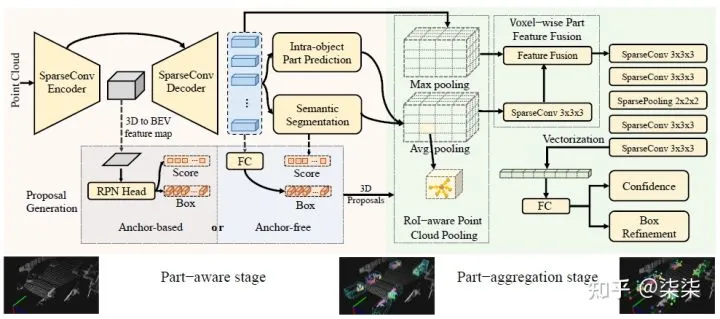
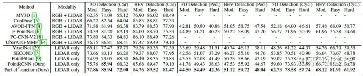
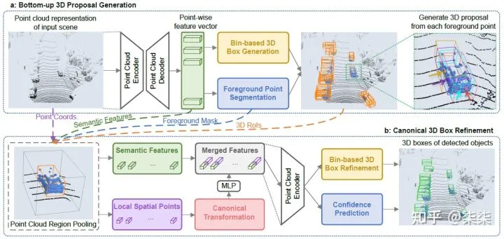
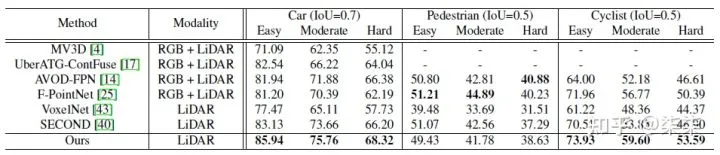
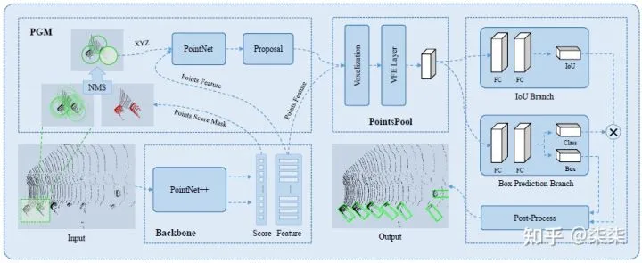
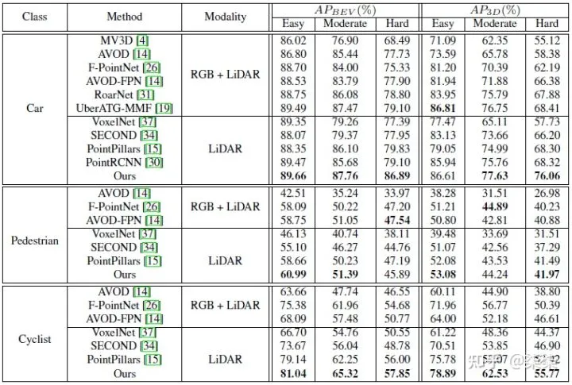
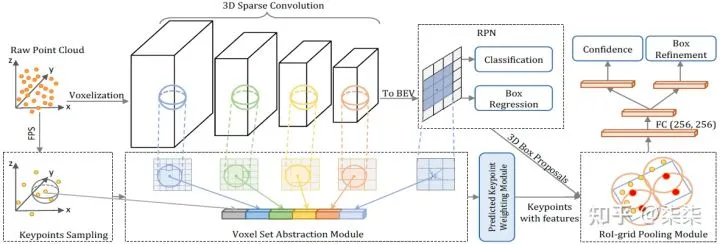
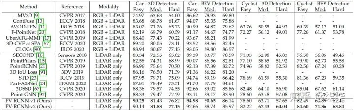
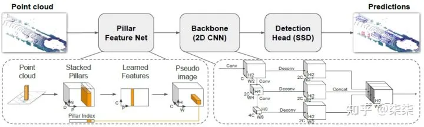
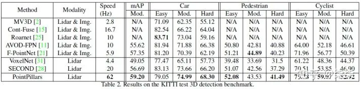

# 3D Detection 论文及源码汇总

> 3D Detection 论文汇总 引用于 [3D视觉工坊](javascript:void(0);)，原始链接[见此](https://mp.weixin.qq.com/s?__biz=MzU1MjY4MTA1MQ==&mid=2247587662&idx=2&sn=e83bb5261bcd9b26a7b0ea166fb56696&chksm=fbfdbc7acc8a356caac4e26c249ef815662fc0a85b9049a60c34b44d8e71d83369b0fa6a3a22&mpshare=1&scene=1&srcid=1210KFVbLKYzClAvcDgCfOyz&sharer_sharetime=1639098637126&sharer_shareid=f9fc55907139617307cb20b918f6b448&version=3.1.20.90367&platform=mac#rd).

------

## **一、论文分类汇总**

### 1. 基于激光雷达点云的3D检测方法（LiDAR only）

| 方法名称    | 方法类别   | 发表年份     | 代码是否开源 |
| ----------- | ---------- | ------------ | ------------ |
| Part-A^2    | LiDAR only | TPAMI 2020   | √            |
| PointRCNN   | LiDAR only | CVPR 2019    | √            |
| STD         | LiDAR only | ICCV 2019    |              |
| PV-RCNN++   | LiDAR only | CVPR 2020    | √            |
| PointPillar | LiDAR only | CVPR 2019    |              |
| MVP         | LiDAR only | NIPS 2021    | √            |
| SE-SSD      | LiDAR only | CVPR 2021    | √            |
| SA-SSD      | LiDAR only | CVPR 2020    | √            |
| HVPR        | LiDAR only | CVPR 2021    | √            |
| LiDAR RCNN  | LiDAR only | CVPR 2021    | √            |
| SECOND      | LiDAR only | Sensors 2018 | √            |
| 3DIoUMatch  | LiDAR only | CVPR 2021    | √            |
| CenterPoint | LiDAR only | CVPR 2021    | √            |
| 3DSSD       | LiDAR only | CVPR 2021    | √            |
| CIA-SSD     | LiDAR only | AAAI 2021    |              |

### 2. 基于多模态融合的3D检测方法（LiDAR+RGB）

| 方法名称    | 方法类别  | 发表年份   | 代码是否开源 |
| ----------- | --------- | ---------- | ------------ |
| AVOD-FPN    | LiDAR+RGB | IROS 2018  | √            |
| F-PointNet  | LiDAR+RGB | CVPR 2018  |              |
| F-ConvNet   | LiDAR+RGB | IROS 2019  | √            |
| 4D-Net      | LiDAR+RGB | ICCV 2021  | √            |
| MV3D        | LiDAR+RGB | CVPR 2017  |              |
| CM3D        | LiDAR+RGB | WACV 2021  |              |
| H^2 3D RCNN | LiDAR+RGB | TCSVT 2021 | √            |
| ContFuse    | LiDAR+RGB | ECCV 2018  |              |
| MMF         | LiDAR+RGB | CVPR 2019  |              |

### 3. 基于单目图像的3D检测方法（Monocular）

| 方法名称  | 方法类别  | 发表年份   | 代码是否开源 |
| --------- | --------- | ---------- | ------------ |
| AutoShape | Monocular | ICCV 2021  | √            |
| CaDDN     | Monocular | CVPR 2021  | √            |
| MonoDLE   | Monocular | CVPR 2021  | √            |
| DDMP      | Monocular | CVPR 2021  | √            |
| GUPNet    | Monocular | ICCV 2021  |              |
| FCOS3D    | Monocular | ICCVW 2021 | √            |
| PGD       | Monocular | CoRL 2021  | √            |
| MonoGRNet | Monocular | TPAMI 2021 |              |

### 4. 基于双目图像的3D检测方法（Stereo）

| 方法名称    | 方法类别 | 发表年份  | 代码是否开源 |
| ----------- | -------- | --------- | ------------ |
| SIDE        | Stereo   | WACV 2022 |              |
| LIGA-Stereo | Stereo   | ICCV 2021 | √            |
| E2E-PL      | Stereo   | CVPR 2020 | √            |

### 5. 基于视角特征提取的3D检测方法

| 方法名称    | 方法类别          | 发表年份   | 代码是否开源 |
| ----------- | ----------------- | ---------- | ------------ |
| H^2 3D RCNN | Front & Bird view | TCSVT 2021 | √            |
| PointPillar | Bird view         | CVPR 2019  | √            |
| F-PointNet  | Frustum           | CVPR 2018  |              |
| F-ConvNet   | Frustum           | IROS 2019  | √            |
| TANet       | Bird view         | AAAI 2020  | √            |

### 6. 基于特征补充/伪点云生成的3D检测方法（pseudo augment）

| 方法名称        | 方法类别       | 发表年份  | 代码是否开源 |
| --------------- | -------------- | --------- | ------------ |
| PointPainting   | pseudo augment | CVPR 2020 |              |
| PointAugmenting | pseudo augment | CVPR 2021 |              |
| E2E-PL          | pseudo augment | CVPR 2020 | √            |
| Pseudo-LiDAR    | pseudo augment | CVPR 2019 | √            |
| Pseudo-LiDAR++  | pseudo augment | ICLR 2020 | √            |
| MVP             | pseudo augment | NIPS 2021 | √            |

### 7. 基于transformer的3D检测方法 （Transformer）

| 方法名称 | 方法类别    | 发表年份  | 代码是否开源 |
| -------- | ----------- | --------- | ------------ |
| VoTr     | Transformer | ICCV 2021 |              |
| CT3D     | Transformer | ICCV 2021 | √            |
| M3DETR   | Transformer | Arxiv     |              |
| DETR3D   | Transformer | CoRL 2021 | √            |
| PoinTr   | Transformer | ICCV 2021 | √            |

### 8. 基于半监督学习的3D检测方法（Semi supervised）

| 方法名称   | 方法类别        | 发表年份   | 代码是否开源 |
| ---------- | --------------- | ---------- | ------------ |
| 3DAL       | Semi supervised | Arxiv      |              |
| 3DIoUMatch | Semi supervised | CVPR 2021  | √            |
| WS3D       | Semi supervised | TPAMI 2021 | √            |

## **二、论文分类解读**

由于篇幅限制，本文主要讲解基于激光雷达点云的3D检测方法(LiDAR only)。LiDAR only 指的是此类方法仅仅采用点云数据作为输入，方法的主要区分性在于对点云数据不同的特征提取方式。

### **1. Part-A^2 （TPAMI 2020）**

论文地址：https://arxiv.org/pdf/1907.03670.pdf
作者单位：The Chinese University of Hong Kong
代码地址：GitHub - open-mmlab/OpenPCDet: OpenPCDet Toolbox for LiDAR-based 3D Object Detection.
一句话读论文：The ground-truth boxes of 3D object detection not only automatically provide accurate segmentation mask because of the fact that 3D objects are naturally separated in 3D scenes, but also imply the relative locations for each foreground 3D point within the ground truth boxes.

网络框架图：

KITTI testset 实验结果：

整体网络框架分为两个部分：Part-aware stage 和 Part-aggregation stage。

- **Part-aware stage**：作者认为前景点的相对位置(intra-object part location)可以表征物体的形状信息。因此，通过估计前景点的相对位置，作者认为可以得到更具有辨别性的特征。

The part-aware network aims to extract discriminative features from the point cloud by learning to estimate the intra-object part locations of foreground points, since these part locations implicitly encode the 3D object’s shapes by indicating the relative locations of surface points of 3D objects.

- **Part-aggregation stage**：既然是一个aggregation mechanism，作者具体聚合了哪些特征呢？文中作者主要融合了两部分特征，point-wise part location 以及 point-wise sementic features。利用融合后的特征，进一步预测每一个候选框的置信度和位置。

By considering the spatial distribution of the predicted intraobject part locations and the learned point-wise part features in a 3D box propsoal from stage-I, it is reasonable to aggregate all the information within a proposal for box proposal scoring and refinement.

### **2. Point RCNN （CVPR 2019）**

论文地址：https://arxiv.org/pdf/1812.04244.pdf
作者单位：The Chinese University of Hong Kong
代码地址：https://github.com/sshaoshuai/PointRCNN
一句话读论文：The learned point representation from segmentation is not only good at proposal generation but is also helpful for the later box refinement.

网络框架：

KITTI testset 实验结果：

PointRCNN 整体为two-stage的框架，第一级生成proposal (Bottom-up 3D Proposal Generation)，第二级对proposal进行微调并得到最终的检测结果 (Canonical 3D Box Refinement)。

- **Bottom-up 3D Proposal Generation**：主要目的是做proposal的生成。对每一个point，提取point-wise feature，预测其属于前景点的概率和相应的proposal大小。对于生成的大量的proposal，利用NMS进行过滤，只保留其中的300个送入第二级进行微调。
- **Canonical 3D Box Refinement**：提取第一级proposal更精细的特征用于分类回归。更精细的特征包括：点特征+空间位置特征+RoI特征。

### **3. STD （ICCV 2019）**

论文地址：https://arxiv.org/pdf/1907.10471v1.pdf
作者单位：Youtu Lab, Tencent 等
一句话读论文：They propose a point-based proposal generation paradigm on point cloud with spherical anchors.

网络框架：

KITTI testset 实验结果：

整体框架依然属于two-stage的网络，第一级生成proposal，第二级提取更精细的proposal (point+voxel)特征用于微调。与其他工作相比，STD 网络最大的不同之处在于proposal generation的过程中使用了球形anchor (spherical anchors)。那么如何从球形anchor得到proposal呢？其具体步骤是：

为所有点设定球形anchor → 判断其为前景点的概率 → NMS 过滤冗余anchor → 预测余下的anchor对应的proposal。

**作者认为这种球形anchor的优点在于：**球形anchor可以不必考虑物体朝向问题，极大减小了计算量；

### **4. PV-RCNN/PV-RCNN++（CVPR 2020）**

论文地址：https://arxiv.org/pdf/2102.00463.pdf
作者单位：The Chinese University of Hong Kong
代码地址：https://github.com/open-mmlab/OpenPCDet
一句话读论文：They propose a novel two-stage detection network for accurate 3D object detection through a two-step strategy of point-voxel feature aggregation.

网络框架：

KITTI testset 实验结果：

整体框架属于two-stage，有两个核心内容，第一个voxel feature → keypoints feature，第二个keypoints feature → proposal/grid feature。

- **voxel feature → keypoints feature**。

  将大量的voxel feature 整合在少量的keypoints上，整合的过程包括了：原始raw points feature + multi-scale voxel feature + bev feature；

- **keypoints feature → proposal/grid feature**。

  这一步其实就是利用之前整合的keypoints feature对每一个proposal做RoI Grid Pooling。只是需要额外注意的是，这个的grid 半径是多尺度的，作者认为这种方式可以提取更丰富的proposal feature。

### **5. PointPillar（CVPR 2019）**

论文地址：https://arxiv.org/pdf/1812.05784.pdf
作者单位：Oscar Beijbom and nuTonomy: an APTIV company
一句话读论文：A novel encoder which utilizes PointNets to learn a representation of point clouds organized in vertical columns (pillars).

网络框架：

KITTI testset 实验结果：

本文仅做学术分享，如有侵权，请联系删文。

**3D视觉精品课程推荐：**

[1.面向自动驾驶领域的多传感器数据融合技术](http://mp.weixin.qq.com/s?__biz=MzU1MjY4MTA1MQ==&mid=2247576799&idx=3&sn=661cf2e1a7175da584fd25940864a1c4&chksm=fbfd87ebcc8a0efd2bb5f402b561944bf249994718ab69907e369ada03a8ccc99ad371ffacb6&scene=21#wechat_redirect)

[2.面向自动驾驶领域的3D点云目标检测全栈学习路线！(单模态+多模态/数据+代码)](http://mp.weixin.qq.com/s?__biz=MzU1MjY4MTA1MQ==&mid=2247580753&idx=1&sn=174f87726a07cc67247c528de0e924ca&chksm=fbfd9765cc8a1e732c08cbaedaa78b35df43c1cb47ef94bad9ec1c942b9be63cf63a64e8c53f&scene=21#wechat_redirect)

[3.彻底搞透视觉三维重建：原理剖析、代码讲解、及优化改进](http://mp.weixin.qq.com/s?__biz=MzU1MjY4MTA1MQ==&mid=2247561631&idx=1&sn=630753b3f9f2073859ac959720e9ee19&chksm=fbfddaabcc8a53bdcd0f09720e85a7fd747ad023a4a5f6ffd45f411526e476e24f0cdd940cf5&scene=21#wechat_redirect)

[4.国内首个面向工业级实战的点云处理课程](http://mp.weixin.qq.com/s?__biz=MzU1MjY4MTA1MQ==&mid=2247566224&idx=1&sn=f17560bea905e2d79026535671a93976&chksm=fbfde8a4cc8a61b2b8fc942b9f901aaf2abcaa588e9d907b25d40bb2338fdae3ab2acd7170a0&scene=21#wechat_redirect)

[5.激光-视觉-IMU-GPS融合SLAM算法梳理和代码讲解](http://mp.weixin.qq.com/s?__biz=MzU1MjY4MTA1MQ==&mid=2247578337&idx=2&sn=82874540e20fa63a172fffb6ed0c7b60&chksm=fbfd99d5cc8a10c3688d24ce9b17fae52686e7ed57adc15d124dd9aad49830e71763d565e9f9&scene=21#wechat_redirect)

[6.彻底搞懂视觉-惯性SLAM：基于VINS-Fusion正式开课啦](http://mp.weixin.qq.com/s?__biz=MzU1MjY4MTA1MQ==&mid=2247578308&idx=1&sn=49e7df6489aae327cff98666ebd834ac&chksm=fbfd99f0cc8a10e686b5624488ae9082cc96bdbe7ca577d4ef5a4528c29883f19c305e71d7db&scene=21#wechat_redirect)

[7.彻底搞懂基于LOAM框架的3D激光SLAM: 源码剖析到算法优化](http://mp.weixin.qq.com/s?__biz=MzU1MjY4MTA1MQ==&mid=2247574465&idx=2&sn=fedfbd2dfe0d5ed95a2e94bf1c0eb595&chksm=fbfd88f5cc8a01e38dcc1d4d3e41d43bc76552989908f004b9c61d1b57c7e2af9cf810d19adf&scene=21#wechat_redirect)

[8.彻底剖析室内、室外激光SLAM关键算法原理、代码和实战(cartographer+LOAM +LIO-SAM)](http://mp.weixin.qq.com/s?__biz=MzU1MjY4MTA1MQ==&mid=2247577601&idx=2&sn=fe17b0201a2060acc3fc3ababe536d73&chksm=fbfd9b35cc8a1223099e44b7a00fc48dc8aa785528e0259b0a8644dfb4f209f0483e65711778&scene=21#wechat_redirect)

[9.从零搭建一套结构光3D重建系统[理论+源码+实践\]](http://mp.weixin.qq.com/s?__biz=MzU1MjY4MTA1MQ==&mid=2247581719&idx=1&sn=25c6d0d47749342a800267380bc95df7&chksm=fbfdab23cc8a2235ab56a432311cdab139cd1825f147a9b49b7e306fd517e52a381c3629f7cb&scene=21#wechat_redirect)

[10.单目深度估计方法：算法梳理与代码实现](http://mp.weixin.qq.com/s?__biz=MzU1MjY4MTA1MQ==&mid=2247582082&idx=2&sn=cc10291ddfdf6b05bdae71887c7c819c&chksm=fbfdaab6cc8a23a020a7359eae081f06c24572a12975bfd90396ac583a0081750f489db89b49&scene=21#wechat_redirect)

[11.自动驾驶中的深度学习模型部署实战](http://mp.weixin.qq.com/s?__biz=MzU1MjY4MTA1MQ==&mid=2247584979&idx=1&sn=6a9821711ee868337903c4f718b09077&chksm=fbfda7e7cc8a2ef1001483e1acad6b0c1ba70bb3c2893ba724b814c41ffc4be3a88cadf71c83&scene=21#wechat_redirect)

[12.相机模型与标定(单目+双目+鱼眼）](http://mp.weixin.qq.com/s?__biz=MzU1MjY4MTA1MQ==&mid=2247584973&idx=2&sn=ef02522d58ecfa575ffbe9dded7cb52c&chksm=fbfda7f9cc8a2eefa9b0f5a17dbaadf9a68fc2133a6fd27c767ab7834e584d9d98182cbfeffa&scene=21#wechat_redirect)

