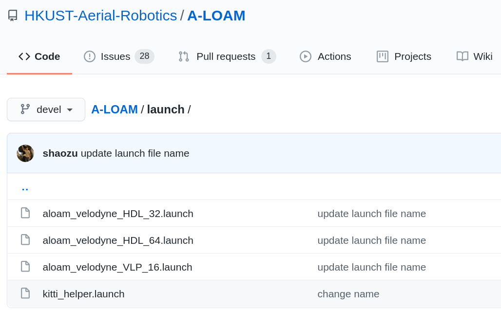

# Run A-LOAM with the Ouster SDK recorded bag/pcap

 

## 1. A-LOAM:

- [Github link](https://github.com/HKUST-Aerial-Robotics/A-LOAM) it has detailed installation instructions
- Requirements
  - Install ROS (16.04+)
  - Ceres Solver
  - PCL
- Topics
  - Takes in *:/velodyne_points* which is ROS topic *:sensor_msgs/PointCloud2
  - Outputs: trajectory in /tf 
- More
  - Run both real time and offline
  -  Only able to process 1 sensor
  - Only support 16, 32 and 64 channels.
- 

## 2. Ouster SDK:

- Ouster bag

  - Topic: name: `osf /sensor1/lidar_packets` type: `sensors/PacketMsg`

  - Convert the Ouster bag to the Velodyne bag by following Ouster Github [Playing Back Recorded Data](https://github.com/ouster-lidar/ouster_example#playing-back-recorded-data) section. Record the `/os_cloud_node/points` topic.   

  - ```sh
     roslaunch ouster_ros ouster.launch replay:=true metadata:=<path to metadata json>
     rosbag play DICT_TO_BAG/[bag_name].bag          
     rosbag record /os_cloud_node/points
    ```

- Ouster pcap
  - Convert to an Ouster bag and follow the step one.
    - I use sw team pcap_to_bag executable to convert a pcap to a bag. Not sure it is the easiest way for customers. Need advice here!
  - I used the **OS0-64 Uniform beam spacing** sample data from ouster.io for testing

 

## 3. Launch:

- Choose the right launch for the right channel.

 

  The bag I use is 64 beams **OS0-64 Uniform beam spacing**

`roslaunch aloam_velodyne aloam_velodyne_HDL_64.launch`

●  Play the bag and [remap](https://wiki.ros.org/roslaunch/XML/remap) the topic */os_cloud_node/points* to the topic */velodyne_points*

`Rosbag play YOUR_OUSTER_BAG_DIR/[bag_name].bag /os_cloud_node/points:=/velodyne_points` 

