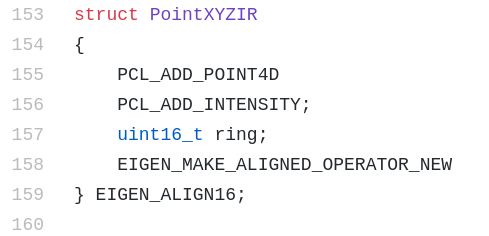
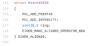

# Run Lego-LOAM with the Ouster SDK recorded bag/pcap

 

## 1. Lego-LOAM:

- [Github link](https://github.com/RobustFieldAutonomyLab/LeGO-LOAM) it has detailed installation instructions
- Requirements
  - ROS (16.04+)
  - Gtsam. If lego loam install gtsam from source way doesn’t work, you can try https://gtsam.org/get_started/ to Install GTSAM from Ubuntu PPA* section
- Topics
  - Takes in `:/velodyne_points` which is ROS topic `:sensor_msgs/PointCloud2`
  - Outputs: 
    - `trajectory in /tf`
    - `global map in /sensor_msgs::PointCloud2`
- More
  - Run both real time and offline
  - Only able to process 1 sensor
  - All ouster sensors and all channels but need to modify the code.
  - The IMU message is optional in Lego-LOAM. Lego-LOAM requires a 9-axis IMU while the Ouster lidar internal IMU is 6-axis. Lego-LOAM has a decent result without IMU. If customers need a better result, they can install an external 9-axis IMU
- Code change required:
  - Code changes in the file */**LeGO-LOAM/include/utility.h***
  - 
  - 

Need to change ring type *from uint16_t to uint8_t*. [[1\]](#_msocom_1) [[2\]](#_msocom_2) Ouster uses uint8_t as ring’s type, we have to make sure matching the type to prevent PCL invalid casting resulting wrong ring’s value

 

■   

In line 164, change *uint16_t to uint8_t* as well

 

■   

Lego-Loam already has Ouster lidar data. In order to use Ouster lidar, we need to comment out the default Velodyne lidar parameters (around line 63) and uncomment the Ouster parameters. 
 

\1. N_SCAN: vertical resolution 

\2. Horizon_SCAN: horizontal resolution from lidar mode

\3. ang_res_y and ang_bottom are not used when we use the ring value. So we can ignore it

\4. groundScanInd: it means how many scans we define as ground from to bottom. The small vertical resolution and the sensor is closer to ground, this number should be bigger. It affects how accurately the algorithm segments the ground point cloud. 

​         Ouster lidar parameters can be found here [Link](https://ouster.com/products/)

 

■   

scanPeriod is the 0.1 for 10HZ setting (for example 1024*10) and scanPeriod is the 0.05 for 20HZ setting (1024*20)

■   

LoopClosure on/off depends on l*oopClosureEnableFlag* which is off default

 

 

○   Code change in the file ***/LeGO-LOAM/src/imageProjection.cpp\***

■   

Uncomment line 165[[3\]](#_msocom_3) [[4\]](#_msocom_4) [[5\]](#_msocom_5) [[6\]](#_msocom_6) 

 

Ouster SDK recorded data to Lego-LOAM playable bag (for offline play purpose):

●   Ouster bag

○   Convert the Ouster bag to the Velodyne bag by following Ouster Github [Playing Back Recorded Data](https://github.com/ouster-lidar/ouster_example#playing-back-recorded-data) section.

○   Record the /os_cloud_node/points topic.    *roslaunch ouster_ros ouster.launch replay:=true metadata:=<path to metadata json>
 rosbag play DICT_TO_BAG/[bag_name].bag          
 rosbag record /os_cloud_node/points*

●  Ouster pcap

○   Convert to an Ouster bag and follow step one.

■   I use sw team pcap_to_bag executable to convert a pcap to a bag. Not sure it is the easiest way for customers.

○   I used the **OS0-64 Uniform beam spacing** sample data from ouster.io for testing

 

Launch:

●   Lauch the lego Loam

*roslaunch lego_loam run.launch*

●  [Run in offline without IMU message] Play the recorded bag and [remap](https://wiki.ros.org/roslaunch/XML/remap) the topic */os_cloud_node/points* to the topic */velodyne_points*

*rosbag play YOUR_OUSTER_BAG_DIR/[bag_name].bag --clock --topic /os_cloud_node/points /os_cloud_node/points:=/velodyne_points*

●   [Run real-time] 

○   Remap the topic name in the launch file

​       In the */ouster_example/ouster.launch b/ouster_ros/ouster.launch* file, add       *<remap from="/os_cloud_node/points" to="/velodyne_points"/>* to the ouster_ros node.

​       (don’t forget to remove this line after using the lego-LOAM)

 

○   Run A-LOAm real time with Ouster lidar. Follow the [Running ROS Nodes with a Live Sensor](https://github.com/ouster-lidar/ouster_example#running-ros-nodes-with-a-live-sensor) section in the ouster github. 

 

Lego LOAM loop closure on/off comparison on [Stevens data-set](https://github.com/TixiaoShan/Stevens-VLP16-Dataset) from lego loam [github](https://github.com/RobustFieldAutonomyLab/LeGO-LOAM)

(loop closure on)

(loop closure off)

------

seems like something we could maybe handle to prevent people having to do this..

 

same with the params stuff i guess

yea, we may can change the ouster client code if it benefits customers. 

guesses for why?

I see our lidar timestamp is different with the velodyne timestamp. This timestamp is only used to public/subscribe topics for visualization in rviz. if don't uncomment out this line, the rviz doesn't catch these topics

_Marked as resolved_

_Re-opened_

be cool to say so on the doc