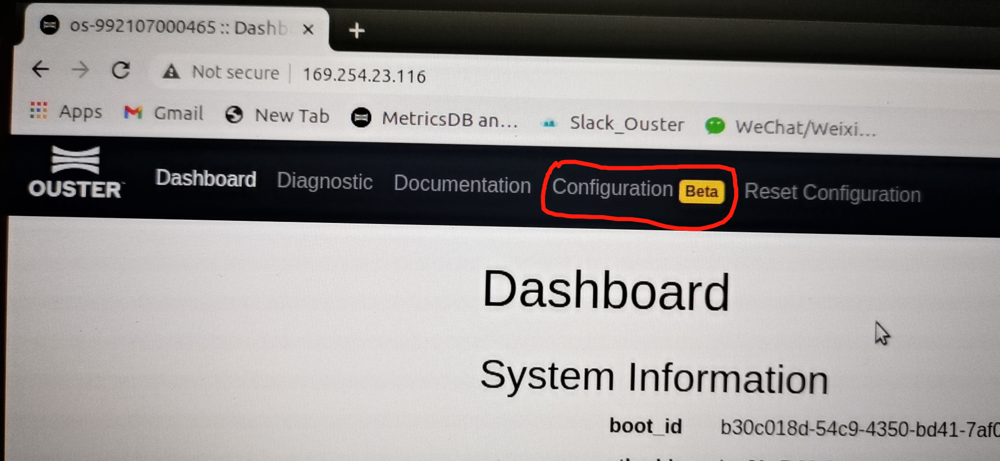
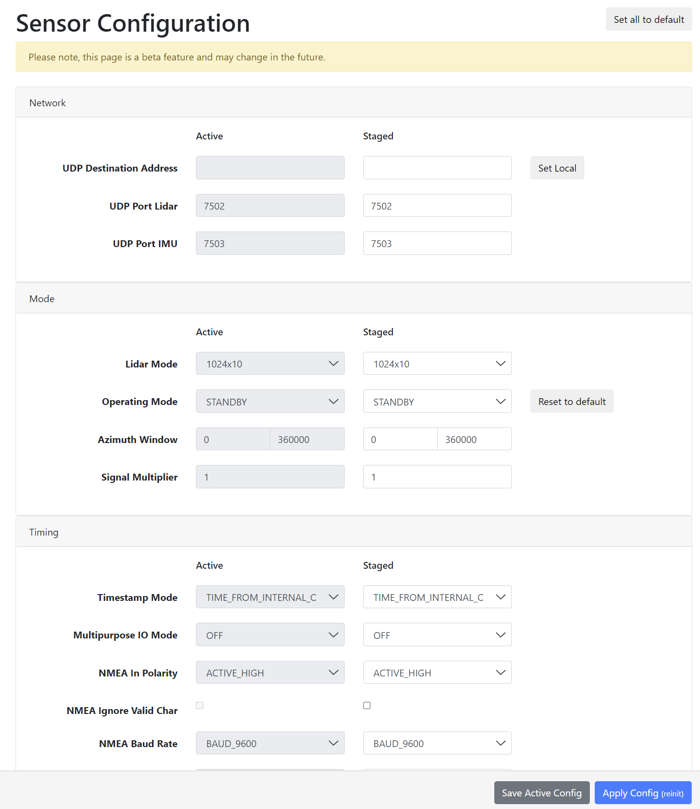
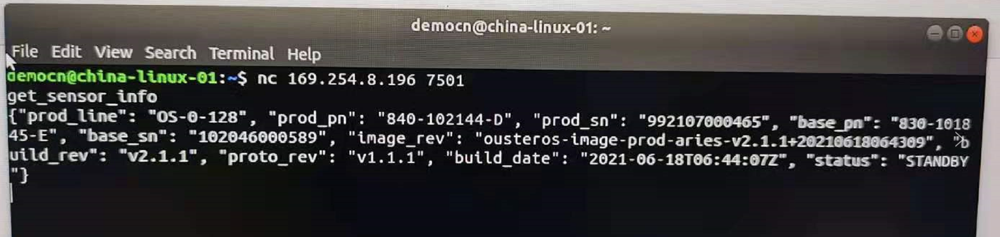

# 雷达参数配置

> 雷达在使用前往往用户需要对其各项参数进行配置，比如设置UDP通讯端口、Lidar Mode、水平视场角和分辨率、信号倍增模式、时间同步以及phase lock等功能。这些设置主要有两种可选的方式实现。

## 1. 确保电脑与雷达连通

具体方法请参看[《如何查询雷达IP并连接》](NetworkIP)。

## 2. 配置雷达参数

### 2.1   方法一：通过网页端查询和配置雷达

> 直接在浏览器中输入雷达IP并回车，就可以登录上雷达。然后点击“Configuration”选项进入雷达配置页面。              

​                 

> 在Configuration页面上，可以对大多数常用的雷达参数进行配置，设置好后点击右下角那个蓝色的”Apply Config” 按钮即可使当前设置生效（雷达会自动重启一次）。然而，此时如果雷达断电，则新设置的内容会丢失并恢复到之前的数值。为了让新的设置在雷达后续断电重启后仍然有效，则可以再点击那个“Save Active Config”按钮，新的参数值会写死到雷达中。 

 

## 2.2   方法二：通过TCP命令进行查询和设置

> 这个方式可以对雷达的各项参数进行全面的查询和设置，是最根本的设置方法，但是该方法主要是面向Linux系统的，需要在终端窗口中用netcat命令来设置。具体设置教程请参看software user manual的“TCP API”一章。这个software manual可以到我们官网下载页面找到。

 