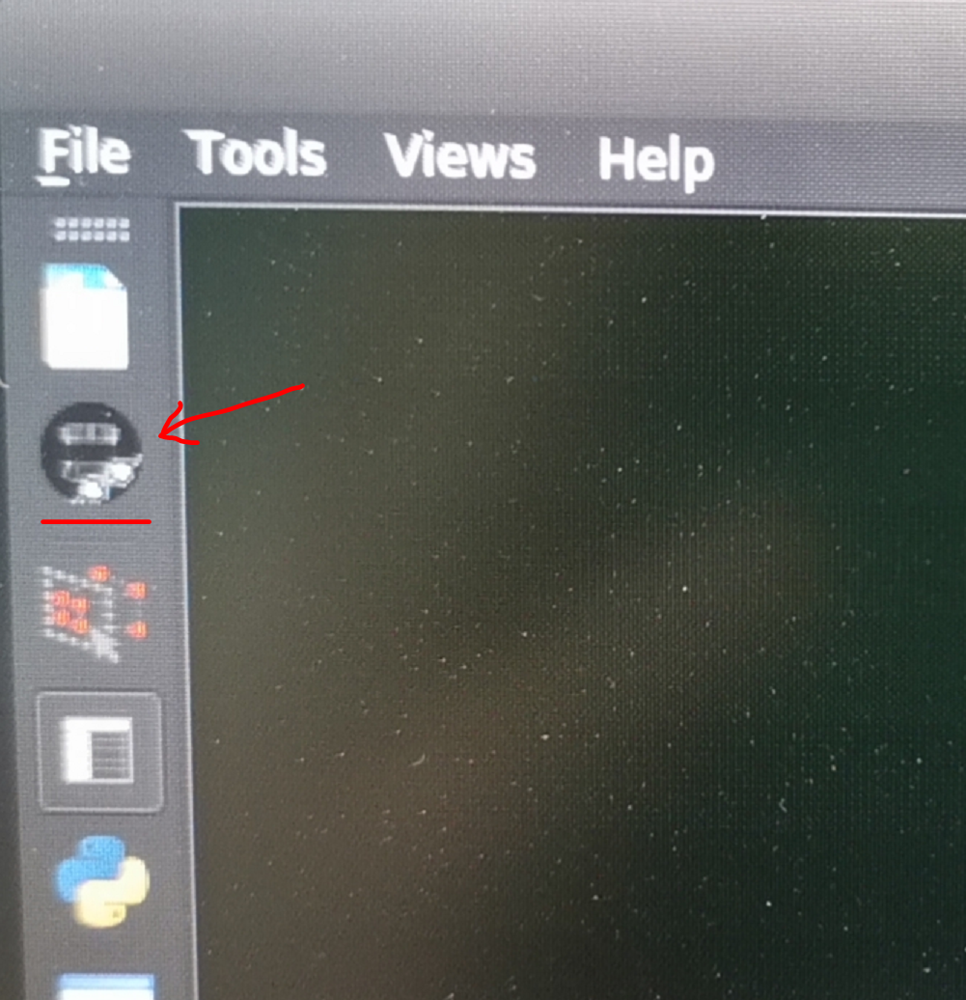
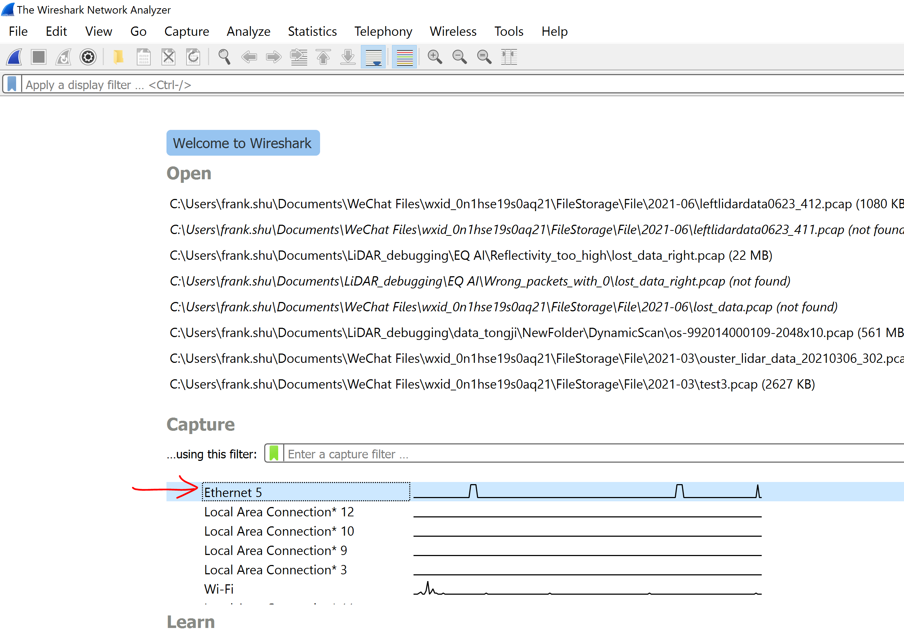
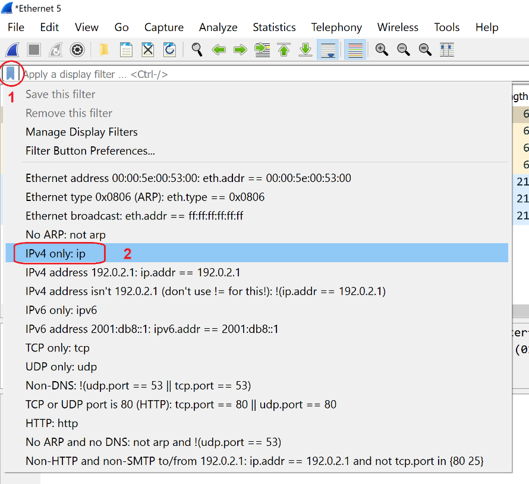
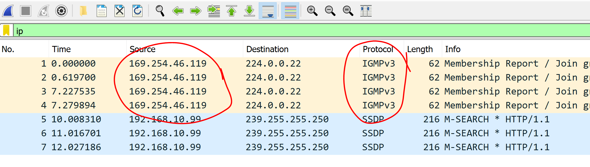
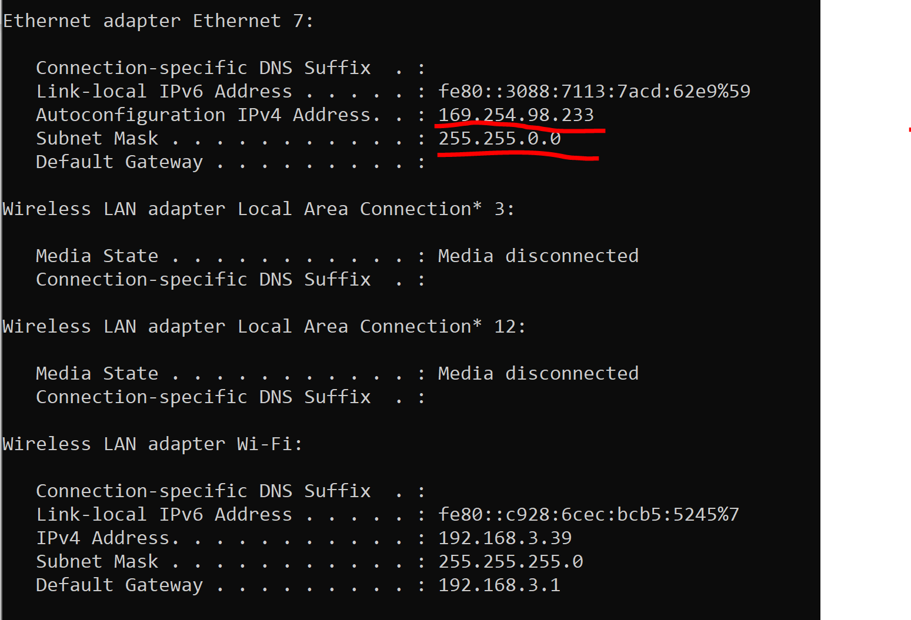
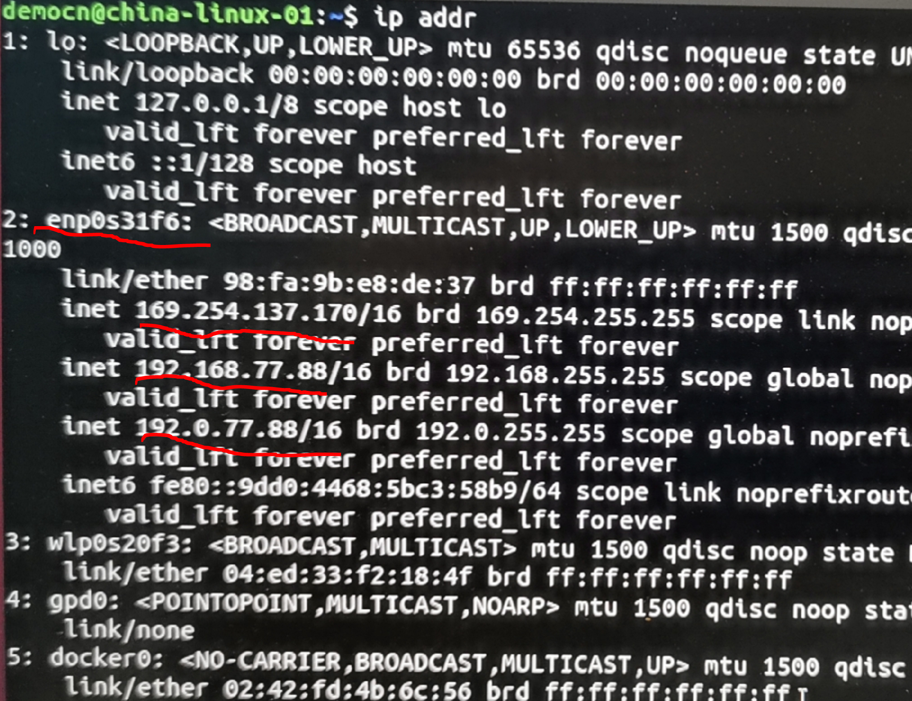

# IP获取与雷达连接

> Ouster 激光雷达使用以太网进行通讯，利用 UDP 进行激光点云和 IMU 的数据传输，利用 TCP 对雷达进行状态查询和配置，也提供 HTTP API （详情见用户手册）可以查询雷达和对一些功能进行设置。
>
> 详细文档见此处：https://drive.weixin.qq.com/s?k=AEYARQeBAAYNEkt08BAE4AvQanABU

## 1. 查询雷达当前IP地址

为了修改雷达IP地址，必须先查到雷达的当前IP地址并确保电脑能连上雷达。根据电脑操作环境的不同，可以通过几种不同的方法进行查询。

### 1.1   Windows系统

#### 1.1.1   用OusterStudio扫描出雷达IP

- 到Ouster官网下载最新的OusterStudio并安装：https://ouster.com/downloads/
- 运行OusterStudio并点击左侧第二个图标：

                               

- 在默认Automatic扫描模式下，一般就能扫描出雷达的IPv4地址，如下图所示雷达IPv4地址是169.254.23.116。当然，有时候OusterStudio也无法扫描出来雷达的IPv4，这时候需要通过Wireshark来查询雷达IP。

 

### 1.1.2   用Wireshark抓包查询雷达IP

- 先下载Wireshark软件安装包：https://www.wireshark.org
- 打开Wireshark并双击与雷达相连的网卡，Wireshark即开始分析该网口处接收的数据包

 

- 设置filter，使Wireshark只显示IPv4数据包

 

- 找到IGMPv3协议的数据包（Membership Report报文），对应的Source IP一般情况下即为雷达IP（雷达会对外广播这类数据包以表明自己的存在）。



### 1.1.3 通过下载安装 [**Bonjour**](https://eyun.baidu.com/s/3kWjPGSB) 工具使用 `dns-sd` 命令。例：

```bash
dns-sd -G v4v6 os-xxxxx.local
```


### 1.2   Linux系统

> 无论是 UDP 还是 TCP，在和雷达通讯前都需要为雷达分配一个本机网络下的可用IPv4地址。下面是不同系统寻找雷达IP地址的方法：
>
> ### Ubuntu - avahi-browse

#### 1.2.1   用avahi-browse命令查询雷达IP

> 新建一个终端窗口，输入 `avahi-browse -lr _roger._tcp` 来查询雷达IP，大部分情况下可以直接获得IPv4地址。注意：有时候需要连续运行2~3次这个命令才会显示出IPv4地址。


> 其中 *hostname* 为该雷达的域名，后面的数字为雷达序列号。可以通过过任一浏览器输入IP或地址 http://hostname (例：http://os(1)-991946000317.local) 访问雷达网页接口。


> 如果返回命令中没有IPv4地址，请将有线连接模式改为**仅本地连接**，重新插拔网线或重启本地网络功能后再次尝试 `avahi-browse -lr _roger._tcp` :
>


#### 1.2.2   用OusterStudio或Wireshark查询雷达IP

Linux下使用OusterStudio或者Wireshark查询雷达IP的方法与上面介绍的Windows下的操作方法差不多，这里不再详述。对于OusterStudio，安装包解压后可以直接运行OusterStudio/bin/OusterStudio这个可执行程序。初次运行时可能需要通过命令行方式在终端窗口中启动该程序，如果弹出错误信息，可按照相应说明补充安装某些动态库后再启动一次。

### 1.3   MacOS系统

MAC OS 系统下，可以使用 `dns-sd` 命令来查找连接雷达的IPv4地址。

```bash
dns-sd -B "_roger._tcp"
```


返回雷达连接的网络实例 ***Ouster Instance 992011000117**，查询该实例的连接情况。

```bash
dns-sd -L "instance name" "_roger._tcp
```


返回 *hostname* （os-992011000117.local），可以用来访问雷达。也会返回序列号和雷达当前固件版本。

通过 Ping 该 *hostname* 可以查看雷达的IPv4地址，并检查网络情况。


遇到如上图可以查询 *hostname* 但是 Ping 不通的情况，请关闭wifi，再次尝试。


## 2. 查找本机IP，确保电脑能ping通雷达IP

查询出雷达IPv4地址后，如果电脑IP与雷达IP不在同一个网段，此时电脑还不能连接上雷达（ping通雷达IP），这样的话无法通过电脑对雷达进行任何参数查询和设置。因此，有时候需要修改电脑网卡IP使其与雷达同一个网段。

### 2.1   Windows系统

首先按Windows键+X并选择Command Prompt来打开一个命令窗口，或者在开始菜单出搜索cmd来打开该窗口。在窗口中输入ipconfig后敲回车，确认与雷达相连的网卡IP地址是否与雷达的IP同一个网段。如果不在同一个网段，则需要修改该网口的IP。




在Windows中修改网卡IP的方法非常简单，可以在网上找到很多介绍资料，[比如这个](http://www.xitongcheng.com/jiaocheng/win10_article_47642.html)

修改好后，请ping一下雷达的IP，确保能ping通。

注意：**如果IP修改后发现IP网段与电脑无线网卡的IP也在一个网段里，那就会引起混淆，此时请暂时关闭无线网卡功能**。

### 2.2   Linux系统

在Linux系统下，可以通过 `ifconfig`，`ip a`或`ip addr`命令查询本地IPv4地址，打开命令行，输入上述三个命令其中之一，比如在终端窗口中执行**ip addr**命令，返回本地IPv4地址如下：

 

如果网卡IP与雷达不在一个网段，则需要修改这个网卡的IP，修改的方法也很简单，网上有很多介绍，比如这个：https://blog.csdn.net/weixin_46219145/article/details/116377214

与Windows中的操作类似，有两点需要确认一下：

·    修改好后，请ping一下雷达的IP，确保能ping通。

·    注意：如果IP修改后发现IP网段与电脑无线网卡的IP也在一个网段里，那就会引起混淆，此时请暂时关闭无线网卡功能。

 

## 3. 单播/广播/组播

可以通过 TCP 设置参数 `udp_ip` 对雷达 UDP 通讯的目标地址进行设置。该参数未设置时，上电后激光雷达将不输出数据，直到接收到该项的相关配置，示例代码：

```bash
set_config_param udp_ip <ip address>
reinitialize
```

如果需要雷达上电后直接向固定地址输出数据，实现**单播/广播/组播**功能，则在设置`udp_ip`参数并重新初始化后，保存该配置：

```bash
#The command write_config_txt will be deprecated in a future firmware. The command save_config_params provides the same response.
#write_config_txt  
save_config_params
```

如果不知道目标IP地址，则可以使用命令`set_udp_dest_auto`，该命令让总动配置雷达将数据发送到发出该命令的地址。

---

[回首页](README)