# Ouster Studio Quick Start

> 由于该软件是我们委托第三方开发，不像OusterViz原生开发，与VLP同底层，而OS Lidar 相对VLP增加了环境光数据及惯导数据，所以在win下兼容性不是很好，我们更推荐采用我们自己开发的OusterViz~
>
> fw1.13或更早：https://www.paraview.org/ousterstudio/
>
> Fw1.14或更新：https://ouster.com/downloads/
>
> [操作手册](https://ouster.atlassian.net/wiki/spaces/SUPPORT/pages/924090373?atlOrigin=eyJpIjoiNTk4MWFjMjk3MzgxNGRlNzg0NjI5Njc0OGY3ODkwN2IiLCJwIjoiYyJ9)：
>
> - [英文版](https://data.ouster.io/downloads/Ouster-Studio-user-guide.pdf?__hstc=34987006.3b498ee11237b4e28da832cc795fa6b7.1603177544769.1606967208102.1607045278647.6&__hssc=34987006.1.1607045278647&__hsfp=3202914155)
> - [中文版](https://ouster.oss-cn-shanghai.aliyuncs.com/get%20started/Ouster-Studio-user-guide.pdf)

## 1. 确保电脑与雷达连通

具体方法请参看《如何查询雷达IP并连接_HowToQueryLidarIPv4Address&Connect》。

- ### Windows Studio 连接注意事项：
  - 关闭wifi及防火墙后，有时候需要重启生效；
  - 注意IPV6还是IPV4; 
  - 注意自动获取还是静态IP；
  - 注意千兆网卡与cat6网线，避免丢包

- Windows Studio 配置注意事项：

  - 如果发现报错，先检查线缆连接与供电，然后用浏览器访问OS1-SN.local或OS-SN.local检查一下是否可以访问，同时Ping一下对应IP或host
  - 注意重新载入文件时候，是否路径当中有中文
  - 基本介绍：https://ouster.com/products/software/ouster-studio-visualizer/

## 2. 在OusterStudio中连接雷达并显示点云

点击左侧第二个图标（Sensor Stream）。

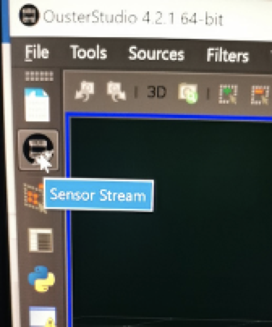                               

程序默认情况下使用Automatic模式扫描电脑各网口上相连的雷达，如下图所示雷达扫描到的IPv4地址是169.254.23.116。如果有好几台雷达，那点击下拉框的箭头可能会显示多台雷达的存在。

 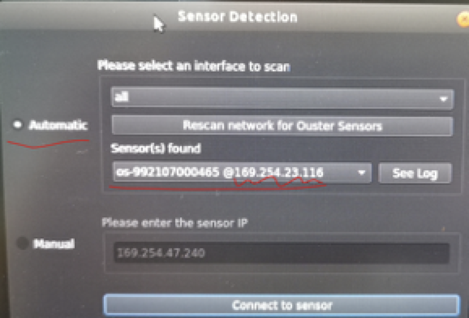

如果自动扫描无法识别到雷达，那就需要在步骤一中找出雷达IP，然后选择下图所示的“Manual”模式，直接输入雷达IP，然后点击“Connect to sensor”。

 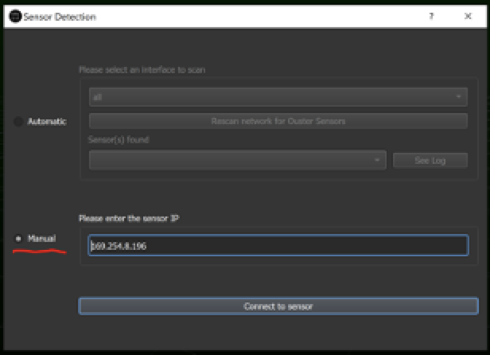

在弹出的新窗口中确认Sensor Status是否为Running。如果是Initializing，则等待1分钟看看是否转为Running。只有当雷达是Running状态才表明启动成功并处于正常运行状态。

在该窗口下还可以设置一些雷达参数，然后点击下面的“Configure”按钮对雷达进行设置（注意这一步必不可少，即使用户使用默认参数）。需要注意的是：在Ousterstudio中设置的参数只能是当前有效，雷达断电后会恢复原先设置。耐心等待Configure过程结束（按钮重新变成灰色）。

 

最后点击底下的“OK”按钮来显示点云图像。

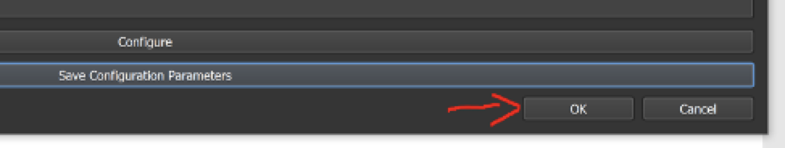 

在主窗口中确认点云是否显现。若没有点云显示，则可能是防火墙没关闭，或者双显卡配置下OusterStudio选用了低性能的集成显卡导致。

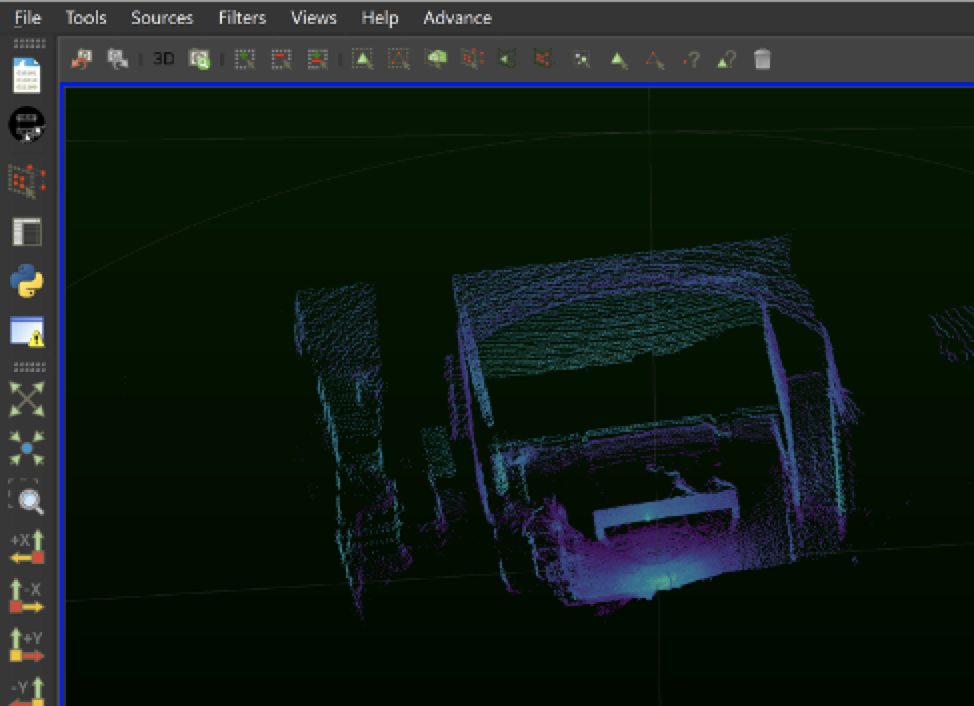

## 3. 设置点云显示效果

### 3.1   选择色彩的映射参数

首先推荐选择用Reflectivity值来给点云上色。当然Ousterstudio也提供了其它各种选择，如下图所示。

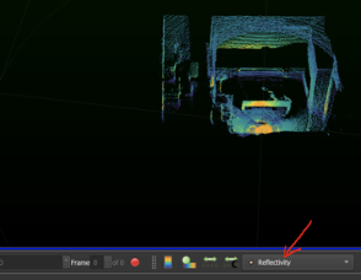    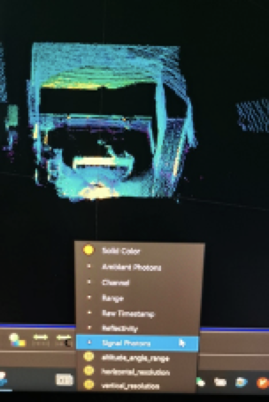

### 3.2   设置色彩映射范围

接下来需要设置合适的颜色映射范围。点击下图中的Rescale to Custom Data Range按钮来进行设置。

   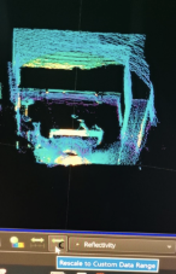

对于Reflectivity描色，建议将映射范围设为0~100。

 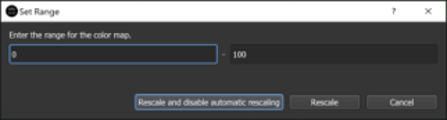

### 3.3   设置调色版类别

点击“Edit Color Map”。

 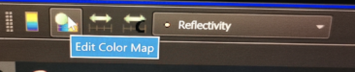

在弹出的窗口中点击“Choose preset”按钮。

 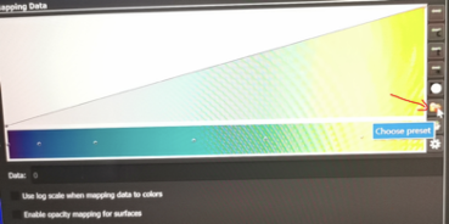

选择中意的调色版：

 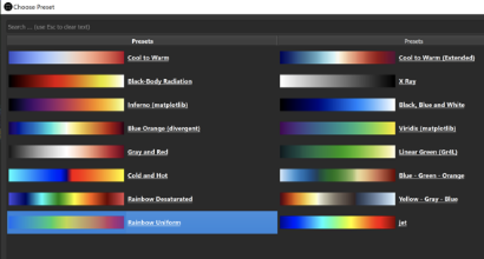

## 4.选择特定区域的点云进行分析

选择左侧的“Select All Points”按钮，此时鼠标光标会变成十字，用户可以在点云画面中拖动鼠标光标来选择感兴趣的点（如右下图所示）。

​     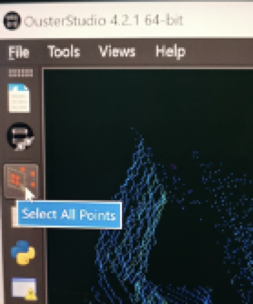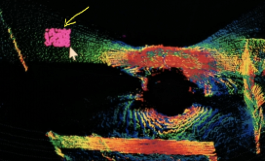

选择好点后，点击左侧的“Spreadsheet”按钮打开数据表。

 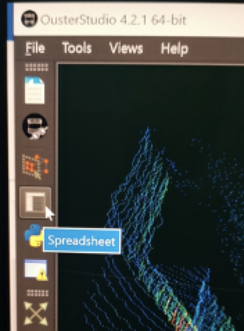

该数据表刚打开时默认显示的是一帧内所有的点云信息，而不是用户选择的那些点的信息。为了只显示用户选择好的点的信息，可以点击右上角的“Show only selected elements”按钮，如下图所示。

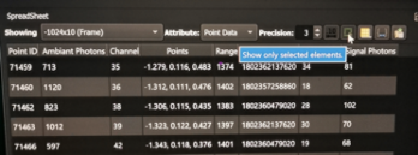 

某些情况下用户希望能将该表格的数据保存到一个文件中进行分析，为此可以点击“Export Spreadsheet”按钮。

 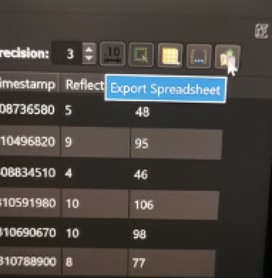

## 5. 保存pcap数据

如果需要采集一段时间的点云数据（pcap包），可以点击窗口下面的那个红色按钮。

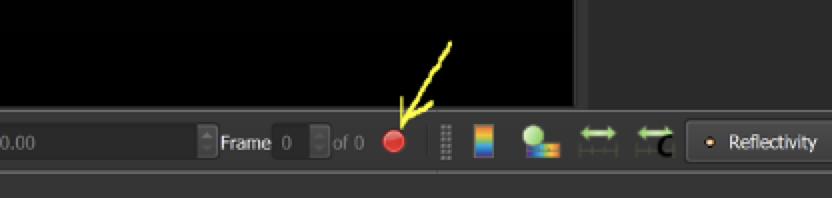 

在弹出窗口中输入pcap文件的路径和文件名，程序同时会保存雷达的内参文件（json文件）。这个内参文件在回放pcap数据时是必须的，否则点云无法解析。

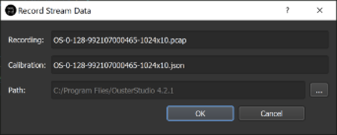 

## 6. 回放点云数据

点击左侧第一个图标来回放pcap点云数据。然后依次导入pcap文件和json内参文件就可以播放了。

 

窗口左下角有各种按键来控制播放的速度和启停。

 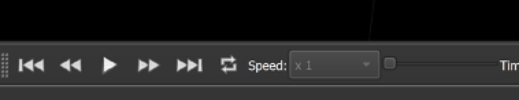

如果要同时播放2D图像，可以点击菜单 View > Lidar as image.

[回首页](README)