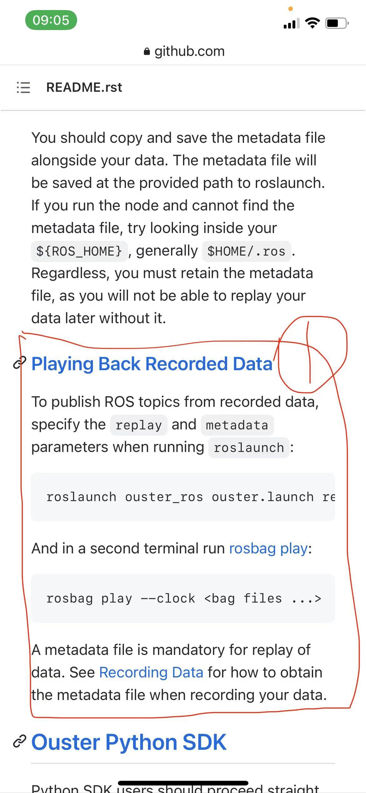
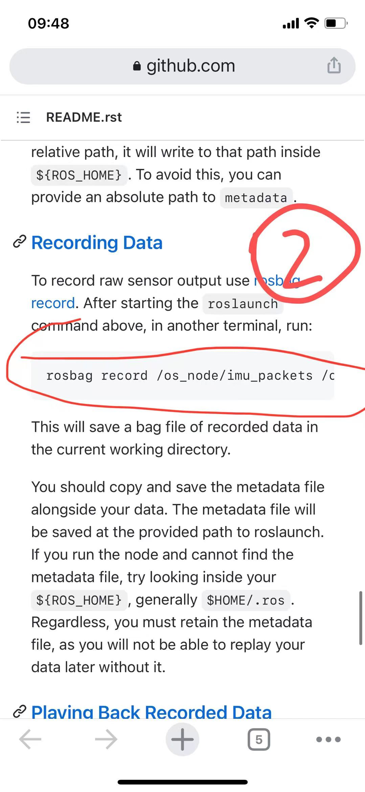

# PCap2Bag

> [`pcap-to-bag`](https://pcap2bag.oslidar.net)这个转换格式包，只是转格式（数据类型是`ouster_ros/PacketMsg`），并不会改动里面的数据，要把数据类型转化为`sensor_msgs/PointCloud2`，你们需要做的是把转换好的bag先用ros replay，然后再同时重新record出来，这才是完整的pcap 到bag的转换过程。

1. 先playing back [`pcap-to-bag`](https://pcap2bag.oslidar.net)转换好的bag（用两个terminal）

2. 第1步两个terminal里的命令运行的同时，**打开第三个terminal**, 记录新的bag文件，但是这里注意你需要使用的命令是“`rosbag record os_clous_node/points`” 不是上图里的`rosbag record os_cloud_node/points`

