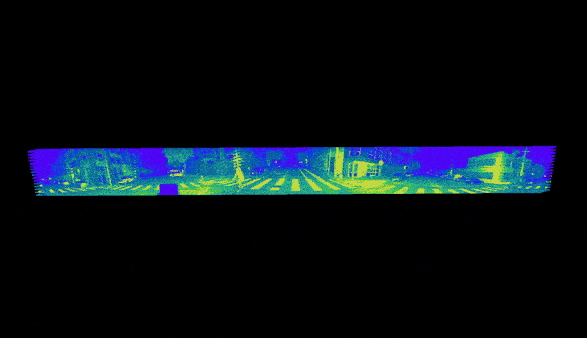

# 感知Perception

## 1.感知Perception 包括哪些内容

- Semantic segmentation (“This group of points is one type of object, and this other group is a different type of object” ==》边界边缘检测 
- Classification (“What is this object?”) ==》物体分类识别
- Object detection (”There are types of object A and types of object B in the scene”) ==》物体成组（许多个体不区分）
- Instance segmentation (“This person is independent from another person in the scene”) ==》个体识别（同种物体的具体个体）

## 2. lidar 应用于感知的优点是？

极低的误报率（无中生有与有中测无），除了**crosstalk (“blooming”)** 时候

## 3.Anatomy of Ouster Pre-fused Data Frame

Ouster lidars are unique in their ability to output camera-like images, which come “**pre-fused**” to the range data. **Pre-fusion** means all data layers are perfectly aligned temporally and spatially at the lowest level of processing.

## 4. Perfect 2D - 3D Spatial Correspondence=>Enabling image-first perception

- Each pixel in a structured 2D image represents a 3D point without any discretization or resampling. 
- No noise or artifacts are added to the perception pipeline which helps boost accuracy while reducing the computational needs significantly
- Various features can be added as channels and new features such as depth gradient and normals are obtained with negligible computational complexity
- Structured point cloud produces order to the points

## 5. 2D *Then* 3D processing

- GPU’s should first process 2D representations with CNNs for:
  - classification
  - bounding box estimation
  - ego motion estimation
- then transform the results to 3D for sensor fusion and higher-level reasoning.

