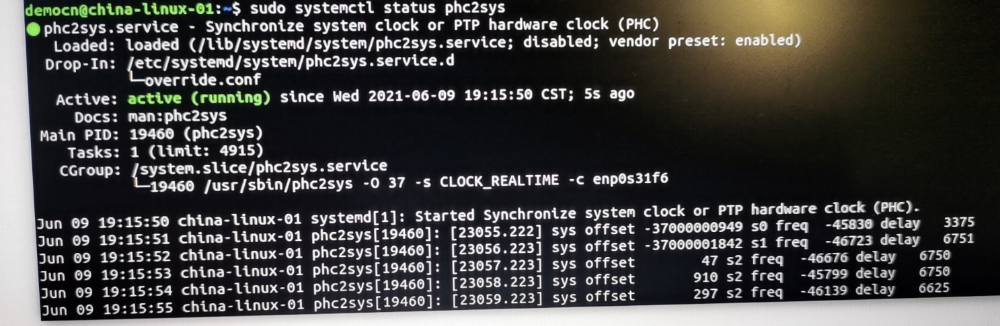
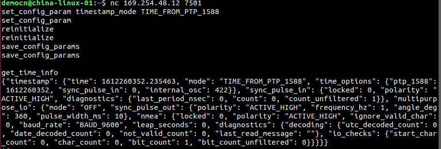

#  Ouster雷达PTP时间同步配置操作说明

> 时间参数：https://drive.weixin.qq.com/s?k=AEYARQeBAAYAxuUPw9AE4AvQanABU
>
> - PTP sync accuracy：≤200 μs
> - PTP clock drift after disconnection： ≤10 μs/s
> - lidar设置好PTP同步后，并不会自动同步起来，还需要执行一个命令使得网卡作为grand master向lidar发送时间同步的message, ` sudo ptpd -i <网卡名> - M ` ,执行后，再通过get_time_info看一下时间是否正确,或者启动data streaming，用 rostopic echo /os_cloud_node/points/header/stamp看一下时间戳对不

## 1. 安装软件工具

在Linux系统中配置PTP需要用到这几个软件组件：

在电脑联入互联网的条件下，安装命令如下：

```sh
sudo apt update
sudo apt install linuxptp ethtool
```

如果电脑不能联网，则可以参考[该网页](https://blog.csdn.net/yao_you/article/details/106872752?utm_medium=distribute.pc_relevant.none-task-blog-baidujs_title-2&spm=1001.2101.3001.4242)上给出的方法来安装软件包

## 2. 确认网卡的时间同步功能

先执行 **ip addr**来查询网卡的名称，**比如enp0s31f6,** 然后用下列命令查询该电脑网卡对于时间同步具备哪些方面的功能：

```sh
sudo ethtool -T enp0s31f6
```

结果类似如下：

 

上面的信息显示该网卡具备hardware PTP功能，同步精度可以比较高（微秒量级）。

如果网卡没有hardware PTP，那我们也可以用software PTP，只是精度会差一点（估计额外的误差在1~2 ms左右）。

## 3. 将网卡配置为grand master clock并运行

先进入目录/etc/linuxptp，然后打开该目录下的ptp4l.conf, 命令如下图所示。

     

找到ptp4l.conf里面的一个条目boundary_clock_jbod，修改其value为1并将用于PTP同步的网卡名添加其中：


注意：上面的enp0s31f6是指网卡名称，用户需要根据实际电脑上的网卡名来给出这个名字。

另外，为防止网络上存在多个master clock而引起冲突，可以将该网卡的ClockClass (时钟等级)设置的高一些，从而使其作为更优先的PTP参考时钟。设置方法很简单，找到clockClass条目，将原先的内容用“#”注释掉然后添加新的条目如下（原先数值为248，新值为128，数值越小表示优先级越高）：


当然，如果确认网络中只有一个master clock，那不需要修改clockClass数值。

如果网卡只有software timestamping功能，则还需要将time_stamping参数的值设为software而不是默认的hardware.

修改好后保存这个ptp4l.conf。接着创建一个新的路径，命令如下：

```sh
 sudo mkdir -p /etc/systemd/system/ptp4l.service.d
```

进入这个路径并在其中创建一个配置文件override.conf，命令如下：

 

执行以上命令后系统会自动打开该override.conf文件，可直接在新窗口中写入如下内容：

 

填好后根据窗口下面的命令提示信息保存文件并退出。

最后重新load ptp4l：

 

正常情况下应该看到类似这种信息：

​    

上面显示“assuming the grand master role”，表明网卡已经作为grand master clock并正常运行，此时它已经开始对外广播PTP同步数据包。上面还给出了该master clock的ID 为98fa9b.fffe.e8de37。 如果sudo systemctl status ptp4l没有显示以上提示信息，则可以多执行几次来查询最新状态，可能需要过十几秒钟才能看到。

## 4. 用Linux系统时钟同步网卡的硬件时钟

默认情况下网卡会去抓取操作系统的时间并作为master clock对外提供参考，但是实际上抓取系统时间的操作本身会带来1~2毫秒的延时，导致PTP同步精度下降。为此，可以通过载入更新的phc2sys系统服务组件对网卡的硬件时钟先进行同步，消除这个延时。方法如下：

先创建一个systemd drop-in目录用于保存重载配置文件：

```sh
sudo mkdir -p /etc/systemd/system/phc2sys.service.d
cd  /etc/systemd/system/ 

#然后进入该目录，用前面提到的nano命令创建一个override.conf文件并写入如下内容：
nano override.conf 

[Service]
ExecStart=
ExecStart=/usr/sbin/phc2sys -O 37 -s CLOCK_REALTIME -c enp0s31f6   
#•	上面的enp0s31f6是网卡名，需要根据实际情况给定该名称。
#•	参数 -O 37 是指系统时间（UTC时间）和PTP时间（TAI时间）的37秒 offset （当前的闰秒数），如果希望雷达时钟以UTC来表示，则可设为 -O 0.

  
```

关于PTP同步时的UTC和TAI时间问题（Time Scale usage），可以参考如下表述：

> ptp4l as domain master either uses PTP or UTC time scale depending on time stamping mode. In software and legacy time stamping modes it announces Arbitrary time scale mode, which is effectively UTC here, in hardware time stamping mode it announces use of PTP time scale.
>
> When ptp4l is the domain master using hardware time stamping, it is up to phc2sys to maintain the correct offset between UTC and PTP times.

最后重新运行phc2sys服务：


正常情况下应看到如下类似信息：

 

到此为止，PTP master clock端一般就配置好了。

## 5.将雷达时间同步模式设置为PTP

通过netcat命令连接雷达并设置PTP同步模式，命令形式如下：

```sh


nc <lidar_ip> 7501

set_config_param timestamp_mode TIME_FROM_PTP_1588

reinitialize

save_config_params

#The command write_config_txt will be deprecated in a future firmware. The command save_config_params provides the same response.
#write_config_txt  
```

下图为示例：

   

上图中最后通过**get_time_info**获取雷达的时钟信息，可以发现其时间显示为16多亿秒，并且同步模式是TIME_FROM_PTP_1588，这说明雷达时间已经被正确同步上了。

## 6. 确认PTP同步状态

可以通过http **http://<lidar_ip>/api/v1/system/time/ptp** 来查询当前雷达的PTP同步状态，如下图所示。关注点已经在红框中标出。其中最重要的那个”**offset_from_master**” 指的就是雷达时钟与PTP master时钟的同步差异，单位为ns。在PTP成功同步时，该数值一般小于1 ms。

         


请参考《用户手册》中[相关章节](https://drive.weixin.qq.com/s?k=AEYARQeBAAYy6dZVMzAE4AvQanABU)。

---

[回首页](