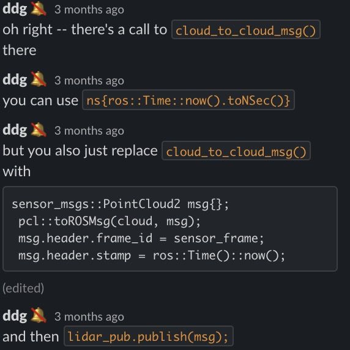

# Ouster雷达基于ROS时间

> 可以不进行时间同步，使用ROS时间，但是需要更改源码。

1. To replace that second instance of `h->timestamp` with `ros::Time::now())`

2. 在os_cloud_node.cpp的70行,改成这样:  `lidar_pub.publish(ouster_ros::cloud_to_cloud_msg(cloud, ros::Time::now(), sensor_frame));`

3. 但是由于ros::Time::now()的数据类型不是ns，所以：

   

   

