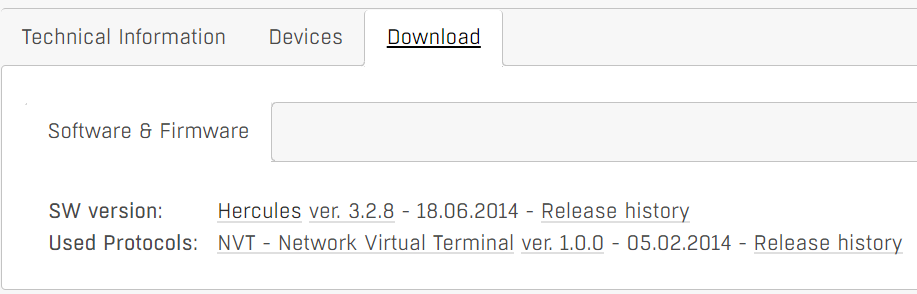
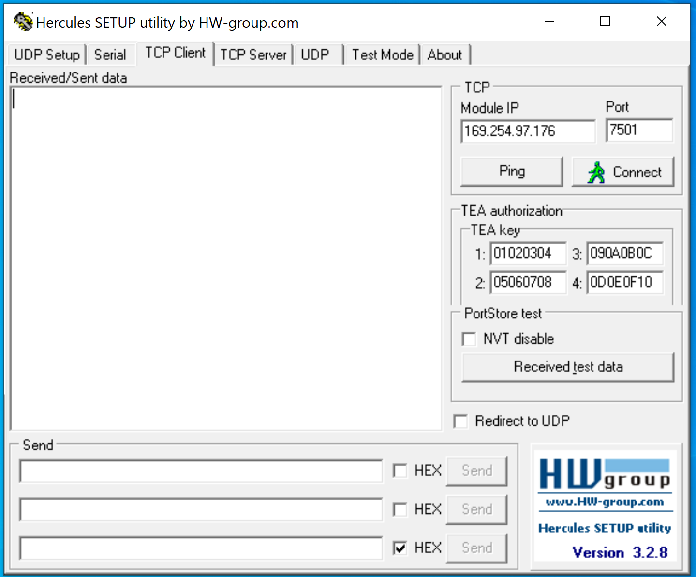
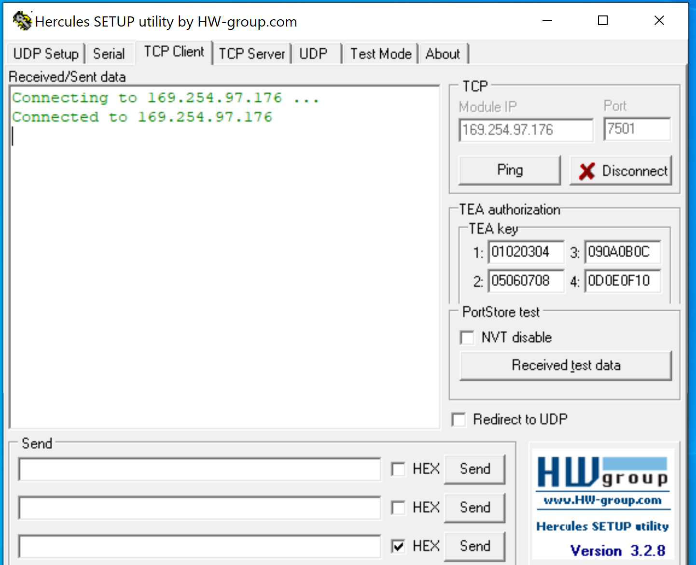
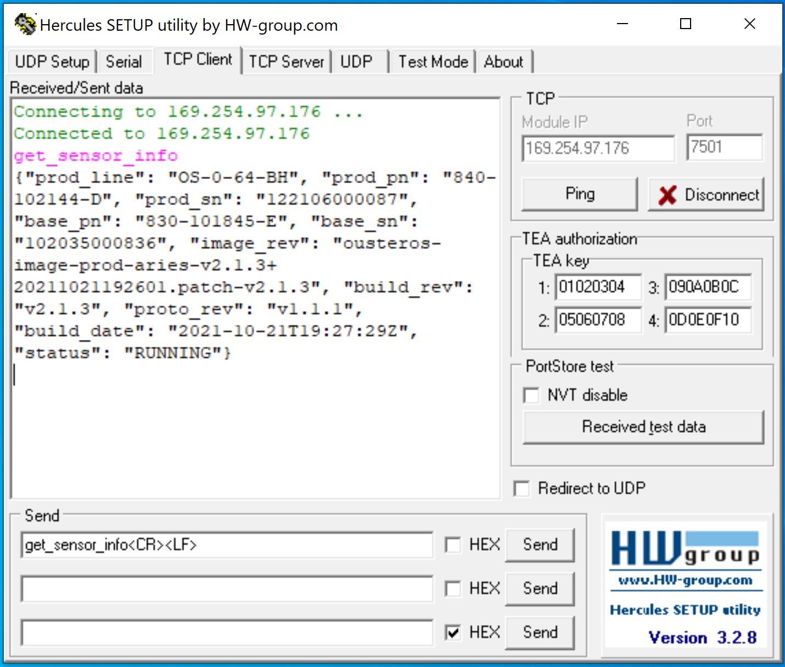
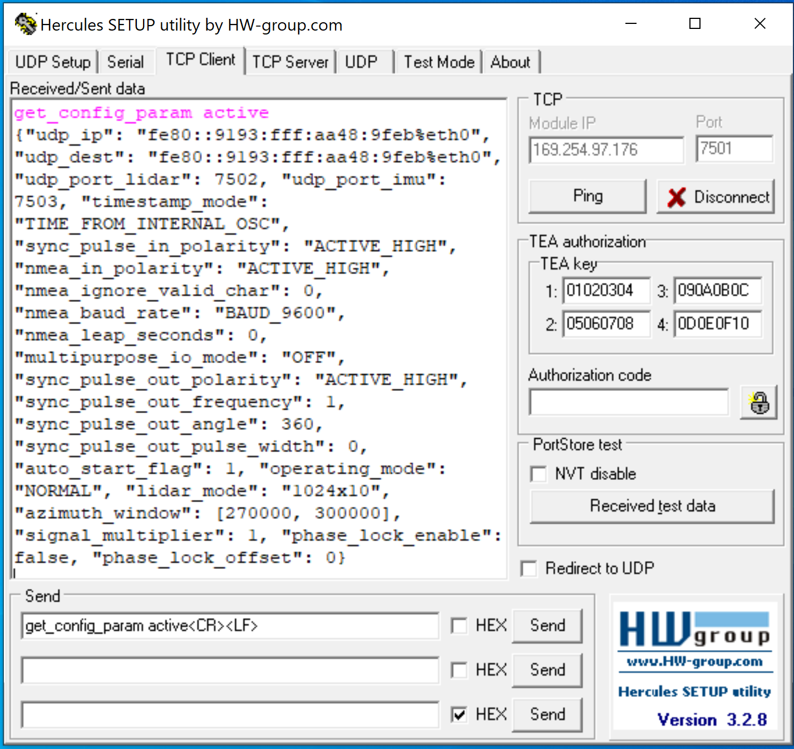
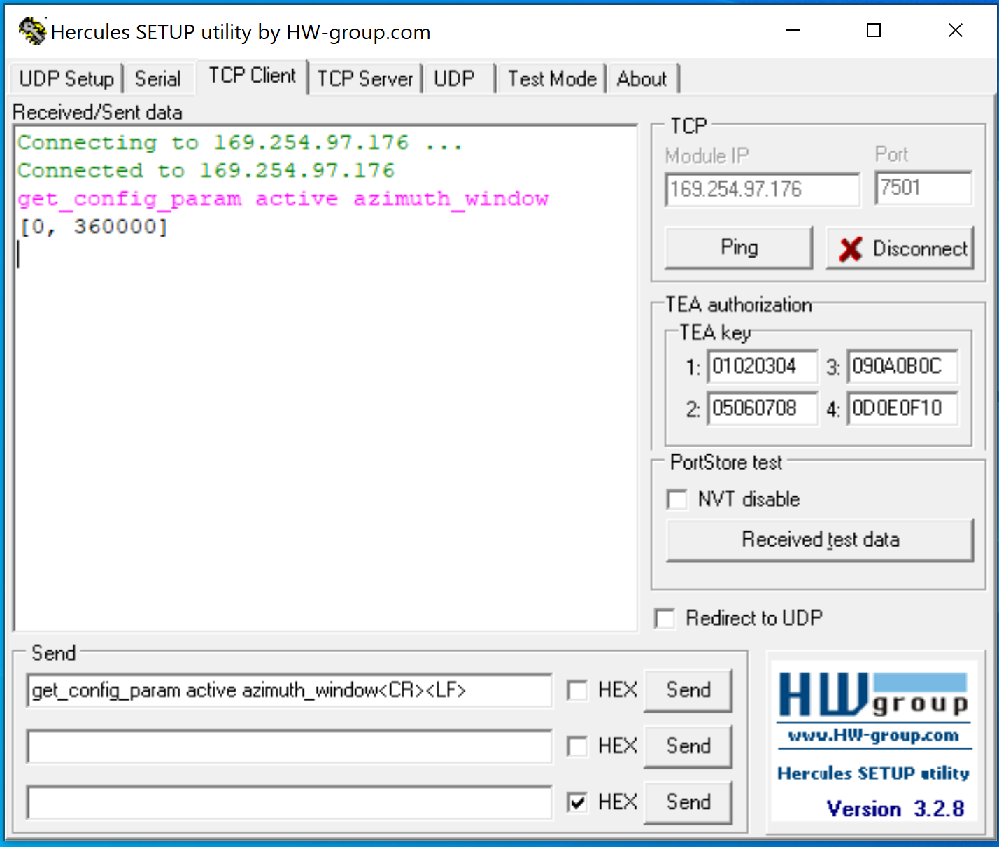
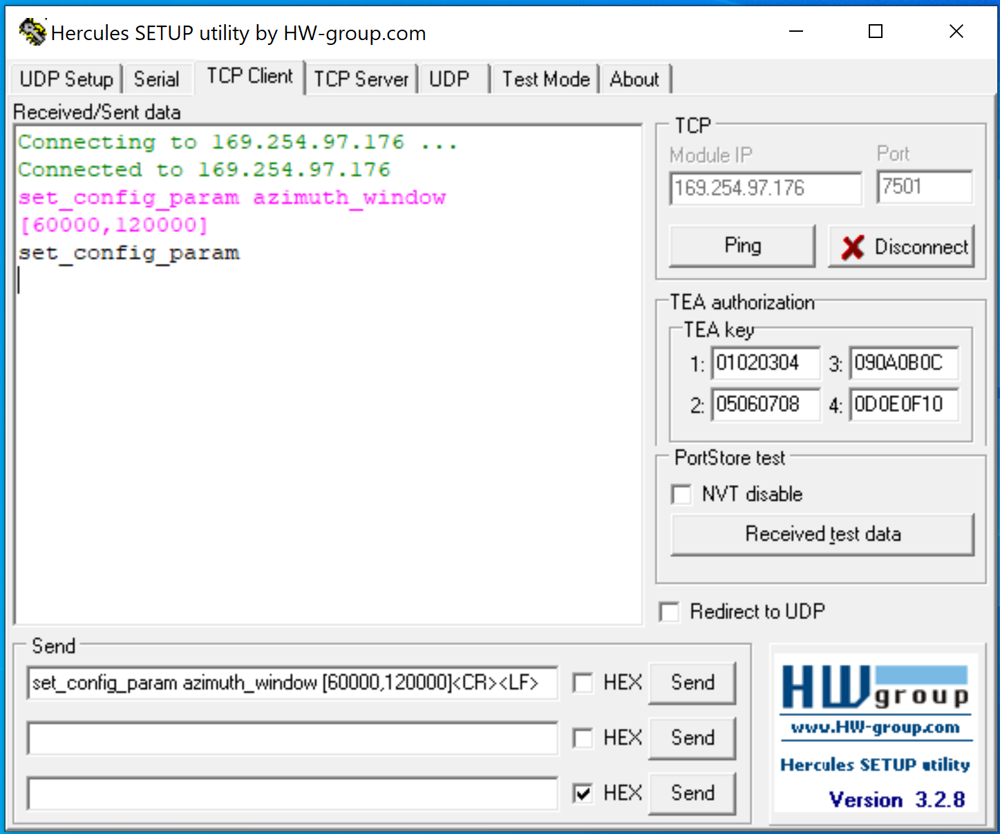
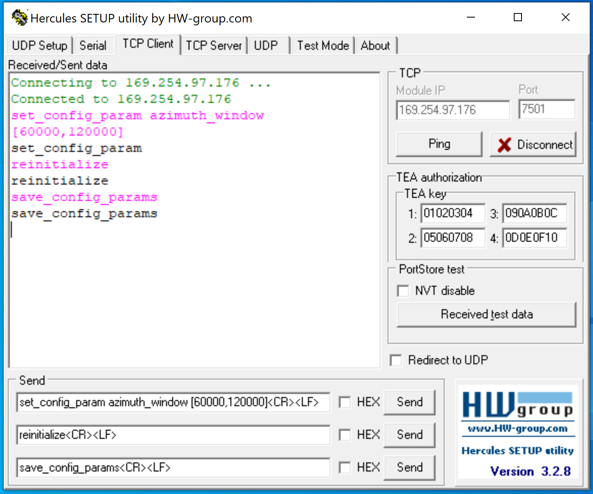

# TCP API 指令获取与修改雷达参数

  

## 1. **OSx** **系列激光雷达TCP端口**

> TCP和UDP是不同的传输控制协议，修改UDP的端口号不影响TCP端口号的使用。

 Ouster OS系列激光雷达的TCP默认端口号为7501。

激光雷达的TCP端口号未作修改的情况下，可以直接使用该端口号；如果使用中修改了TCP的端口号，也可以使用新修改的端口号。

## **2.  TCP API调试助手软件**

> TCP API调试软件推荐使用可以从网上免费下载并且免安装的调试助手软件 Hercules。
>
> 调试软件下载链接：https://www.hw-group.com/software/hercules-setup-utility

## 3. TCP API调试助手软件连接OSx激光雷达

- 确保雷达接线及供电已经完成。
- 打开软件后，点击“TCP Client”。
- 在右侧的Module IP中输入激光雷达的IP地址，Port中输入TCP端口号。此处用默认的7501。
- 点击“Connect”按钮。

- 当按钮显示的内容切换为“Disconnect”，且文本框中显示“Connected to”激光雷达的IP地址，则激光雷达与TCP API调试助手软件实现了连接。 

## 4.  OSx激光雷达参数获取指令

激光雷达的参数获取指令包含获取整体信息的指令和获取具体参数配置的指令。

获取整体信息的指令举例：                                                                                        

- `get_sensor_info`，获取激光雷达型号、序列号、软件及固件信息等内容。
- `get_lidar_data_format` ，获取激光雷达的数据格式信息。
- `get_config_param`，获取激光雷达当前运行的所有参数配置。

获取具体配置参数的指令举例：                                                                                          

- `get_config_param udp_port_lidar`，获取激光雷达的UDP端口号。
- `get_config_param sync_pulse_in_polarity`，获取同步脉冲输入端的极性。
- `get_config_param azimuth_window`，获取激光雷达的扫描角度范围。  
- `get_config_param active operating_mode`，获取激光雷达的当前工作模式。

## 5.  OSx**激光雷达参数获取操作示例**

通过TCP API的get_sensor_info指令获取激光雷达数据的示例。

 通过TCP API的get_config_param指令获取激光雷达所有运行参数的示例。

通过TCP API的get_config_param azimuth_window 指令获取激光雷达当前运行角度范围具体参数的示例。

## 6.  OSx**激光雷达参数设置指令**

> 通过指令对激光雷达的参数作设置之后，需要发送初始化的指令才能让正常运行。                                  
>
> 参数配置完成后，发送保存参数的指令才能确保断电后参数不丢失。

设置参数的指令举例：                                                                                         

`set_config_param sync_pulse_in_polarity`，设置同步脉冲输入端的极性。                                              

参数设置结束后的初始化指令： `reinitialize 或 reinit`

保存参数配置的指令：`save_config_params`  

## 7.  OSx激光雷达参数设置操作示例

通过TCP API的set_config_param azimuth_window指令设置激光雷达的扫描角度范围为60°到120°的示例。

 通过TCP API的参数设置指令完成参数配置后，通过reinitialize指令作初始化，并通过save_config_params进行参数保存的示例。

