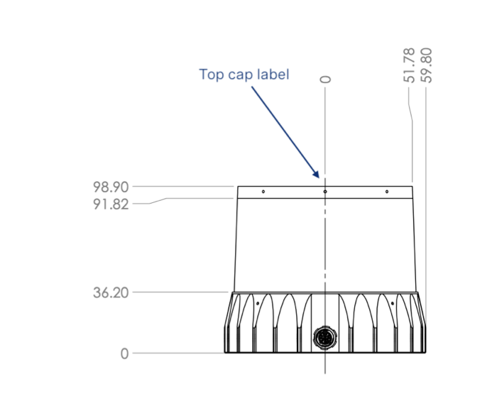

# TMP 

\- New total height will be 1**02.9mm** and the 4mm increase is in the base. Base will now be 40.2mm instead of 36.2mm. Window and top cap remain the same. See illustration of **old** CAD model below for reference

\- New total weight will be **1080g**. The weight increase comes from adding in solid aluminum to the sensor. Harish mentioned this was the least amount of weight he could add to pass shock and vibe.

