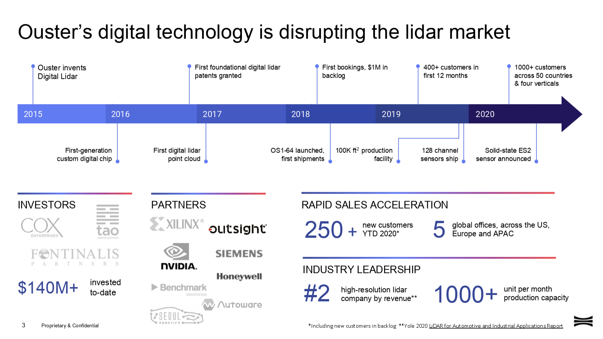

# 背景场景

> 基本介绍，有问题请加微信：Kungfuas

- ### 公司背景：

  我们是一家总部位于加州的激光雷达科技企业，在美洲与亚洲设有生产中心，在香港建立亚太总部负责本地支持&运营。基于**MBF多光束闪光**基础专利，结合**独立ASIC IP设计实现**能力，我们致力于为无人系统、测绘测量、安防监控、工业工程自动化、智慧交通/物流/城市等行业与场景，提供**更高性能、更强可靠性、更具性价比**的深度视觉产品与3D感知解决方案。

  

  

- ### 应用场景：

  **无人系统、[测绘测量](/SMapping)、农业矿井、安防监控、工业工程自动化、[智慧交通/物流/城市](https://drive.weixin.qq.com/s?k=AEYARQeBAAYlRQyC1yAE4AvQanABU)**等[行业与场景](https://drive.weixin.qq.com/s?k=AEYARQeBAAYQGZQK45AE4AvQanABU) 

  ](background.assets/image-20200917194751343.png)

  

- ### 基本介绍：

  - https://ouster.com/get-started/
  - https://ouster.com/lidar-product-details/
  - [Ouster的下一步：量产平价128线激光雷达，远距离+超宽视角，覆盖全应用场景](https://m.gasgoo.com/news/70151304.html)

  

- ### 基础信息：

  - [官方博客](https://ouster.com/blog/)
  - [OSYoutube](https://www.youtube.com/channel/UCRB5JpLey3BA-1P9XyrErTA)            
  - [官方讲座](https://ouster.com/resources/webinars/)
  - [数据可视化](https://ouster.com/zh-cn/resources/lidar-sample-data/)
  - [BOXCN](https://ouster.ent.boxcn.net/folder/0)                
  - [产品照片](https://ouster.oss-cn-shanghai.aliyuncs.com/Ouster_product_photography.zip)
  - [点云照片](https://ouster.box.com/s/5db88cgb7z6hmsk4xj8u32erashebbyk)
  - [实景视频](https://ouster.box.com/s/nxk12awk4pdyqylkhfqhd3t2fwob6aef)            
  - [大陆B站](https://space.bilibili.com/522358013)
  - [官方公众号](https://mp.weixin.qq.com/mp/homepage?__biz=MzI3NjAzODM2NQ==&hid=1&sn=77770ea86f4a7c0c965abeeaaadd4dcd//)

