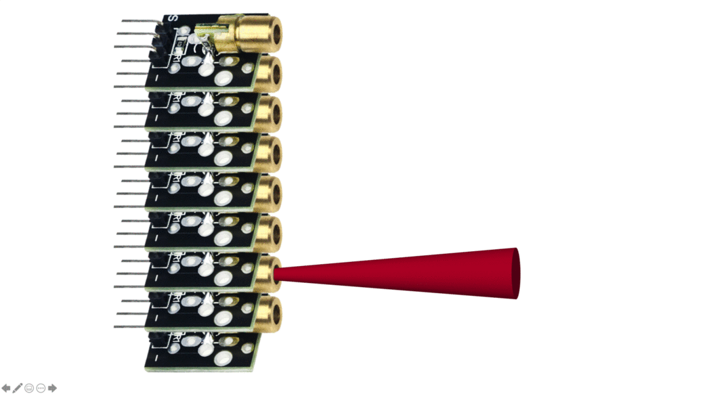

# 应用层

> 此处整理问题，汇总更新，如有问题，请加微信：Kungfuas
>
> 

1. 什么是子光束指向及密度分布，有什么价值？

   纵向FOV 可以变化，可以比如降低到50% 而维持线数不变，可以中间密两边疏，可以只水平向下，如果特别大的用户，我们还可以给他定制，参照此处：https://drive.weixin.qq.com/s?k=AEYARQeBAAYoGIegvHAE4AvQanABUS

2. 客户可以自行及动态更改VFOV么？

   目前并未下发授权Key，但将来不排除

3. OS的PPS对齐是绝对相位对齐，还是相对的频率对齐？

   PPS对齐有相位对齐与频率对齐两种，前者是绝对对齐，以上升沿为标记，后者不要求频率或相位都一致，只需要其保持固定的或成比例的差别。对OS而言，是PPS上升沿对齐，绝对相位对齐。

4. 标准线缆多长？最长可多长？

   5m，目前直到10m有库存，更长可达100m，但需要定制

5. OS的雷达，pixel distance也会随着时间或振动发生变动么，也需要不超过2000hr必须重新校准么？

   不需要，像素元芯片内空间锁定固化，设计寿命内不发生变动

6. OS面阵如何解决串扰？

   - 芯片内阻隔层
   - 像素间亚像素intrinsic offset
   - 多层优化（光圈与镜头）的高准直专利光路
   - Time correlated single photon counting (TCSPC) 时间相关单光子计数及阈值比较器

7. 什么叫时空锁定机制，有什么价值？

   空间锁定：所有像素关系终生固化为芯片内部，不像其他方案：手动挨个装一堆，然后同一部设备不超过2000hr就需要重新标定一次，如果环境恶劣可能是几百小时就得重新标定，更不提批次间不一致; 

   时间锁定：并发，而非串发，所以所有线数收发共享时域。 假设128线，有128ms 发射时间，意味着每条线都有128ms，而不是串发128/128=1ms，所有可以对单一方向进行更多次测量滤波优化。

   并发示意图：.gif)

   串发示意图：

   数据结构示意图：

   

   

   

   

   