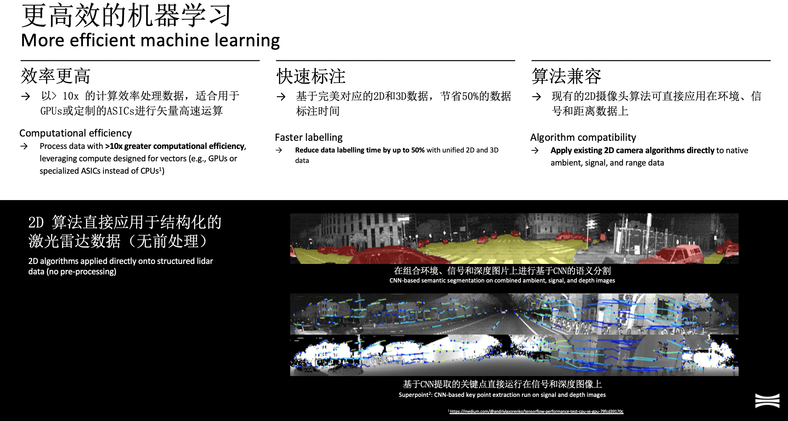
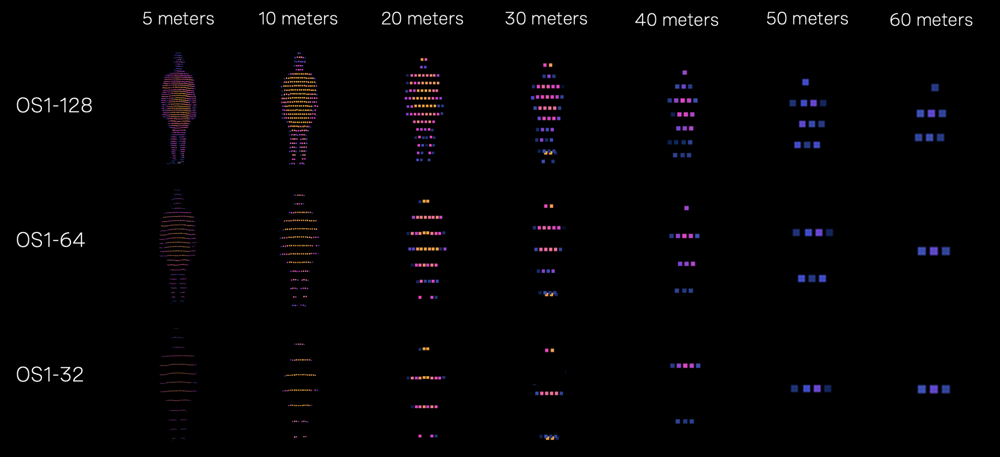
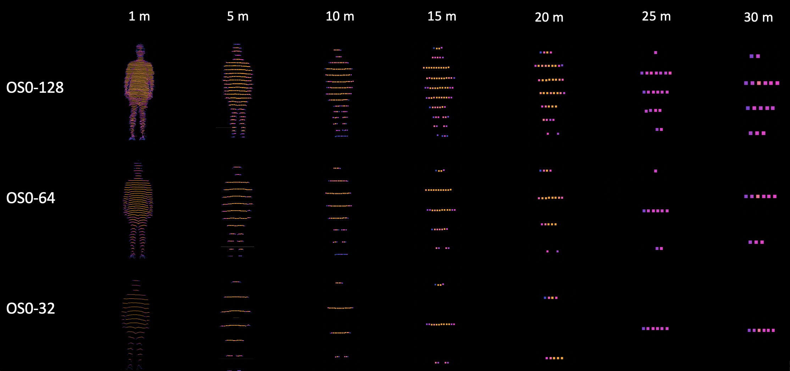

# 应用层

> 此处整理问题，汇总更新，如有问题，请加微信：Kungfuas
>
> 
>
> 

1. 什么是子光束指向及密度分布，有什么价值？

   纵向FOV 可以变化，可以比如降低到50%VFOV 而维持线数不变，可以中间密两边疏，可以只水平向下，可以只水平向上，如果特别大的用户，我们还可以给他定制，参照此处：https://drive.weixin.qq.com/s?k=AEYARQeBAAYoGIegvHAE4AvQanABUS

2. 客户可以自行及动态更改VFOV么？

   目前并未下发授权Key，但将来不排除

3. OS的PPS对齐是绝对相位对齐，还是相对的频率对齐？

   PPS对齐有相位对齐与频率对齐两种，前者是绝对对齐，以上升沿为标记，后者不要求频率或相位都一致，只需要其保持固定的或成比例的差别。对OS而言，是PPS上升沿对齐，绝对相位对齐。

4. 有没有方法在不断电的情况下，使雷达处于省电待机状态？

   目前没有类似standby指令，除非初始化状态下可以发一个TCP让暂不击发，但是一旦击发后除非断电无法进入热待机，只能通过降低帧率与增加定时//定角发射间隔实现。===》最新版本固件会引入低功耗模式这个选项

5. 标准线缆多长？最长可多长？

   5m，目前直到10m有库存，更长可达100m，但需要定制，而且线材可以提供不同的线材转向接口

6. OS的雷达，pixel distance也会随着时间或振动发生变动么，也需要不超过2000hr必须重新校准么？

   不需要，像素元芯片内空间锁定固化，设计寿命内不发生变动

7. 对于尘霾矿场的情况呢？

   灰尘其实一种是在空中潜伏的，一种是落在雷达表面的，所以对灰尘的处理上，首先是不能让灰尘进入雷达造成设备损坏，我们这点上是ip69k。其次，是落在镜头处的灰尘不能影响感知，我们的解决方案是超大光圈，大概是别人的5-10倍。最后是高速漂浮的灰尘不要形成鬼点或者拖曳痕，我们的解决方案是采用了百万分之一秒的超高速快门解决动态糊化，然后采用了最强回波把来自灰尘的弱遮挡信息滤除，只认可灰尘后更强实体的回波。

9. 基于Velodyne的旋转机械雷达，转一圈实际上点云的时间戳是周期性的变换，这样当车在运动的过程中，扫到的一面墙很可能就不是平的了，需要结合车的运动信息进行补偿，才能得到真实的点云，OS雷达也是这样么？OS雷达当中的时间戳是发射时间戳，还是接收时间戳？

   - 位置数据当中的时间戳是发射时间戳；
   - VLP同一方位角不同beam之间，因为是串发轮询，也就是第一个线路发射出去之后，才是第二线发射，在这个时间内，车向前走了一段路，以此类推，比如第128线，他们就有127x deltaT的延时，车就向前走了127x deltaT*V的路，所以他们每个beam都有不同的时间戳需要修正，而OS因为是并发所有任意方位角是同步发射，所以无需修正；
   - 但是水平方位角上，由于会有1024或2048次发射，之间有N-1个offset，因水平发射是周期串行发射，所以仍然要计入相关车体运行的修正，对这360°上不同发射延迟的修正。

10. 什么是并联冗余接收，有什么价值？

    我们每个像素下面其实并联了好多个亚像素，所以即使恶劣环境下，由于种种不可抗力部分或n-1像素瞎了，仍然维持工作，不像其他方案瞎了就是瞎了；这个还可以用于一些更复杂的比如后期pixel-specific filter-powered RGB-ID等场景，同时在不影响信噪比的情况下避免过曝风险

10. OS面阵如何解决串扰？

    - 芯片内阻隔层
    - 像素间亚像素intrinsic offset
    - 多层优化（光圈与镜头）的高准直专利光路
    - Time correlated single photon counting (TCSPC) 时间相关单光子计数及阈值比较器

11. 三帧GID雷视一体的结构化数据有什么价值？

    强光与弱光环境下都有清晰的环视纹理，并且与点云深度时空对齐高度结构化，物理级前渲染，可以高效的实现物体的识别与分割。

    

12. 如何在不同距离上估算雷达的落点？

    可以采用该开源工具[Blensor](https://www.blensor.org/)建模，或采用如下方案估算（人高1.8m）：

    

    

    

