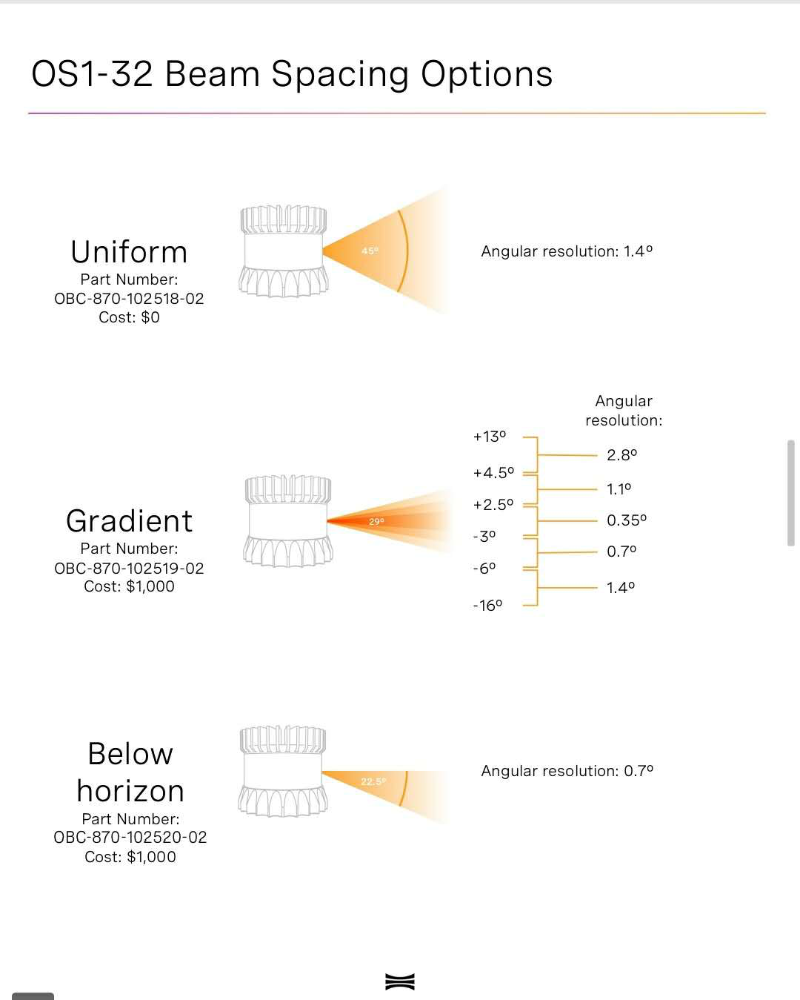

# 应用层常见问题

> 本文主要介绍应用层面的一些常见问题，如需详细解释，请加微信：Kungfuas
>
> 
>
> 

1. 雷达的标定文件从哪里获取？

   OS雷达的标定文件每个都不同，可以通过TCP命令或者Ouster Studio直接从雷达内部读取出来：

   - Studio: 连接雷达时候扫描后出现的json，或者保存pcap数据时会提示在同一个文件夹下同时保存这个.calib文件
   - TCP CMD：参考[API Guide](https://data.ouster.io/beta-program/v1.14-beta-11/Ouster-Sensor-API-Guide-v1.14.0-beta.11.pdf)，例如 get_lidar_intrinsics，get_beam_intrinsics等~ 

2. 什么是子光束指向及密度分布，有什么价值？

   纵向FOV 可以变化，可以比如降低到50%VFOV 而维持线数不变，可以中间密两边疏，可以只水平向下，可以只水平向上，如果特别大的用户，我们还可以特别定制，参照此处（以32线为例）：

3. 客户可以自行及动态更改VFOV么？

   目前并未下发授权Key，但将来不排除

4. OS的PPS对齐是绝对相位对齐，还是相对的频率对齐？

   PPS对齐有相位对齐与频率对齐两种，前者是绝对对齐，以上升沿为标记，后者不要求频率或相位都一致，只需要其保持固定的或成比例的差别。对OS而言，是PPS上升沿对齐，绝对相位对齐。

5. UTC时间与GPS时间有什么不同？设备内是已经通过37s做了个转换么？

   -  所有存在的时间系统全部由两部分组成：一部分是时间基准，或者叫时间原点，即起始时间，另一部分是时间尺度，即时间单位。
   - 我们通常生活的所用的时间都是UTC时间，即世界协调时。它起源于世界时，世界时系统是以地球自转运动为基准的时间系统。也就是我们根据地球自转，公转确定的24小时，一年365天，然后再细分到秒。而世界协调时的秒不是世界时的秒，而是采用了原子时的秒（国际单位制的秒）。原因是世界时受地球自转的影响比较大，地球还受到其他因素的影响，比如极移，岁差等因素的影响，而且一直在变慢。总之，世界时（跟地球有关的时间系统）并不是严格均匀的时间系统，世界协调时是为了调节人们生活的时间和GPS原子时之间的差异而发明的一种时间系统。
   - GPS时间，也就是GPS原子时，它的时间基准是1980年1月6日0点与世界协调时刻相一致，以后按原子时秒长累积计时。GPS时间跟UTC时间之差为秒的整倍数。如1989年为5秒，1996年为11秒，2002年为13秒。到现在为止为37秒左右。
   - 是的，已经做了转换。

6. 什么是无线供电与POE+供电？

   无线供电指的是相对于某些友商采用的滑环接触供电的使用寿命而言，我们是无接触供电，POE+指的是我们与google共享的一个专利设计ibox，可以直接网线同时作为数据传输与供电。

7. windows下默认被识别为IPV6如何操作？

   参考：[OusterStudio @windows](/OusterStudio)

8. 采用ROS VIZ来可视化点云数据，且以intensity着色的时候，发现强度闪烁的事情是正常的么？

   rviz里着色时的默认设置是autocompute，这样的话如果车子行驶中强度最大值变化较大的话是会这样的；也就是说，动态范围着色，在不同帧里，同款颜色对应不同的强度可能；如果不希望这样，可以把autocompute关掉，然后自己设置min 和max.

   

9. 断网关防火墙之后，仍然无效是因为如何？

   - 重启一下，有部分windows重启后防火墙才真正设置生效，改好电脑ip后要disable/enable一次，才会生效
   - 试一下sudo tcpdump -i <interface>，其中<interface>是你电脑上网卡的名称，或者在雷达与电脑连接好的情况下重新启动一次雷达==》本来雷达默认是通过DHCP来动态获取ip地址的，但是如果雷达开机时未与电脑相连，就可能会导致它自己无法根据电脑ip来分配到同一个网段的ip，这时候就需要重启一次雷达，让它重新动态获取一个新的ip
   - 如在Ubuntu下，先把网卡ip设为link-local only，然后重启雷达，完了后再用如下命令看看ip ：

   ```
   avahi-browse -lr _roger._tcp
   ```

   

10. Ubuntu 下正确的ROS驱动安装编译方式是？

   可以直接采用[一键脚本](/OusterROS)，或者遵循如下安装步骤：

   - 进入ouster_example -> ouster_client文件夹，打开README.md, 按照里面的步骤build好client;
   - 进入ouster_example -> ouster_viz文件夹，打开README.md, 按照里面的Build Dependencies步骤完成对dependencies的安装；
   - 最后进入ouster_example -> ouster_ros文件夹，打开里面的打开README.md，按照里面的步骤完成build即可

11. 黑匣子有什么用？如何访问？

   记录从出厂以来的全部操作，用于：

   - 保修期追溯
   - 最近一次的信息采用json明文记录，历史信息bin文件加密，如果遇到问题可以第一时间回传，远程实时判定问题并提供意见
   - 如果确认责任归属于OS，则OS可以提前安排返修或退换，无需等待太长周期

   浏览器访问http://OS(1)-SN.local或IP，可以下载到对应的日志文件，也可以用如下命令：

   - Curl command for MetricsDb: `curl <sensor_ip>/api/v1/system/metricsdb/dump > dump`
   - `Curl command for Journal: `curl <sensor_ip>/api/v1/system/journal/dump > journal.bin`

11. 有没有方法在不断电的情况下，使雷达处于省电待机状态？

   目前没有类似standby指令，除非初始化状态下可以发一个TCP让暂不击发，但是一旦击发后除非断电无法进入热待机，只能通过降低帧率与增加定时//定角发射间隔实现。===》最新版本固件会引入低功耗模式这个选项

11. IMU是硬连接还是软连接，输出原始观测量还是解算值，fps是否可调？

    - IMU与PCB之间是硬连接，没有做抗震设计，主要是为了充分反映雷达自身的振动情况
    - 帧率是100HZ固定帧率不可改暂时
    - 原始观测量，没有解算

12. 标准线缆多长？最长可多长？

    5m，目前直到10m有库存，更长可达100m，但需要定制，而且线材可以提供不同的线材转向接口

13. 收GPRMC数据的接口是TTL电平么？

    可参考[文档](https://drive.weixin.qq.com/s?k=AEYARQeBAAYPgEUwdTAE4AvQanABU)，标准的nmea信号电压是0~5V范围的TTL电压，但是fw1.14b14之后实际基本能覆盖常见的RS232电平。

    至于active_high或者active_low是指PPS上升沿还是下降沿有效，主要由GNSS接收机决定，理论上active_high和active_low都有可能，但是RS232很多都是active_low；注意这里与logic_low和logic_high的电压定义不同，logic_low和logic_high指的是二进制位0和1对应的电压状态。

14. 默认线材是多长的？是否符合低煙無鹵（Low smoke zero halogen）簡稱LSZH 要求？

    默认配5m ibox straight light cable，需要特别长度，不同角度connector，以及pigtail需要特别提出。

    线材符合LSZH要求。

15. 如果将该雷达用于海岸线监控，或防波堤监控，长期在盐雾海水蒸汽的氛围下，OS雷达的可靠性如何？

    ASTM B117-19 salt spray test , per the General Motors quality/reliability guidelines. 1,000 hour duration, 24 hour cycle.S

16. OS的雷达，pixel distance也会随着时间或振动发生变动么，也需要不超过2000hr必须重新校准么？

    不需要，像素元芯片内空间锁定固化，设计寿命内不发生变动

17. 是否有可能采用低帧率高解析度（4096@5fps，8192@2.5fps）的选项提高雷达的性能，适应低动态环境？

    目前该方案在计划中，但目前可考虑多帧合并，但每帧shift一个不同offset方式来等价实现该效果。

18. 何为盲区检测？

    在最小检测距离（盲区）内，比如<25cm，告知0/1代表障碍物的有无，可作极限区域避障，或者污渍覆盖物的检测。

    

19. 何为锁相？

    

20. 对于尘霾矿场的情况呢？

    灰尘其实一种是在空中潜伏的，一种是落在雷达表面的，所以对灰尘的处理上，首先是不能让灰尘进入雷达造成设备损坏，我们这点上是ip69k。其次，是落在镜头处的灰尘不能影响感知，我们的解决方案是超大光圈，大概是别人的5-10倍。最后是高速漂浮的灰尘不要形成鬼点或者拖曳痕，我们的解决方案是采用了百万分之一秒的超高速快门解决动态糊化，然后采用了最强回波把来自灰尘的弱遮挡信息滤除，只认可灰尘后更强实体的回波。

21. 对传统AGV与激光叉车而言，升级到Ouster方案的效益体现在哪里？

    - 如果是针对比如磁钉、二维码或GNSS方案，对原来场地的破坏小、铺设成本低，而且传统方案是无法区分来自实时动态的环境
    - 如果是针对传统视觉VSlam方案，处理器消耗低，延时低，对双目基线结构要求低，对光照与纹理的要求低，适应各种环境包括室外环境
    - 如果是针对传统2D方案，则不仅适配更加复杂多变的动态环境与室外环境，更多feature 可以无需反射板直接弹性铺设，而且哪怕是对室内结构化环境，都可以1代n，导航避障一体化，降低多颗雷达之间的结构校准与时间同步等成本
    - 如果是针对传统的3D slam方案，我们除了轻小、高防与高抗震抗振之外，我们自带了相机（主动纹理相机，被动纹理相机，点云深度相机，而且都是环视）、惯导、黑匣子，时空锁定特性，超高快门，超大光圈，高水雾霾穿透，并联冗余接收，无线及POE+供电，纵向FOV及子光束指向与密度分布可调，以及极具进攻性的高线降维性价比和2周交付能力。

22. 基于Velodyne的旋转机械雷达，转一圈实际上点云的时间戳是周期性的变换，这样当车在运动的过程中，扫到的一面墙很可能就不是平的了，需要结合车的运动信息进行补偿，才能得到真实的点云，OS雷达也是这样么？OS雷达当中的时间戳是发射时间戳，还是接收时间戳？

    - 位置数据当中的时间戳是发射时间戳；
    - VLP同一方位角不同beam之间，因为是串发轮询，也就是第一个线路发射出去之后，才是第二线发射，在这个时间内，车向前走了一段路，以此类推，比如第128线，他们就有127x deltaT的延时，车就向前走了127x deltaT*V的路，所以他们每个beam都有不同的时间戳需要修正，而OS因为是并发所有任意方位角是同步发射，所以无需修正；
    - 但是水平方位角上，由于会有1024或2048次发射，之间有N-1个offset，因水平发射是周期串行发射，所以仍然要计入相关车体运行的修正，对这360°上不同发射延迟的修正。

23. ROS 驱动下，应当订阅哪些topic？

    roslaunch启动后os_node和os_cloud_node都是自动启动的，然后你们的程序只需要订阅os_cloud_node这个节点发出的/points和/imu这两个topic即可。

24. 请问如何理解极坐标到笛卡尔坐标转换过程中，azimuth角度当中有2个构成分量？

    其中左侧encodeID是一套从0-90111的编码（1024 x88，2048 x44），对应着相位角度，encodeID x2π/90112就能得到此刻的偏转相位弧度，另外一个分量来自`get_beam_intrinsics  intrinsic` 或者 ` lidar_origin_to_beam_origin_mm`对每个beam的初始角度的query，可以认为是一个初始offset，*2π/360是为了同样变成弧度，加和就得到了全部真实的相位（初始+偏置）。

25. 目前128线 2048*10hz为例，每秒钟的总点云数目是多少，计入IMU数据后，数据量是多少，用bag或pcap格式？

    - IMU @100HZ数据占比非常低，约0.2%，设置`udp_port_imu` to `"”` 就可关闭该输出；

    - 不同线数的激光雷达的单UDP包大小为：

      - 各系列16线激光雷达每个UDP包大小为3392bytes
      - 各系列32线激光雷达每个UDP包大小为6464bytes
      - 各系列64线激光雷达每个UDP包大小为12608bytes
      - 各系列128线激光雷达每个UDP包大小为24896bytes
      
    - 每16个方位角的数据组成一个UDP包发送出去，如果以2048x10的发射率，意味着每秒发射10fps*2048/16=1280个UDP包，以此换算。

      

26. 目前是多次回波方案么？

    目前选择的是最强回波方案，我们计划在Q4加入多次回波

27. 目前相机是额外一套cmos相机么，最高像素是多少，是彩色相机么？

    并非额外外设，是spads复用，自身不发射，全部来自环境光的灰度信息，最高像素2048*N，N为线数，是灰度相机，但是3帧相机数据是原生时空对齐的。

28. 不同激光雷达反映在点云的数据结构上有什么区别？

    模拟旋转式激光雷达按照一定的频率进行定时激光发射，且无法控制，每秒点数都是固定的。如果需要更改帧率和水平分辨率，则需改变电机旋转速度，但电机速度越快，旋转一周产生的数据点越少。模拟激光雷达水平方向的数据点是不精确且无规律的，会随着激光发射速度和电机转速的改变而改变。VLP体系及一脉相承的HS/RBS/LS等方案，雷达发射只能基于定时发射而无法基于定角发射，VFOV方向是结构化但是时间轮询畸变数据，HFOV方向直接是非结构化数据。

    光纤扫描式激光雷达在水平与垂直方向上均是非结构化数据，任意方位角上都是非结构化且时序轮询畸变数据。

    

    数字激光雷达输出结构化数据，拥有照相级分辨率，既可定时又可定角发射，VFOV方向是结构化并发无畸变数据，HFOV方向仍然是结构化数据，代表着更高数据前融合质量。

    

29. GID物理级前融合是什么意思？

    

    无需处理，完美对齐。

    

    

    

30. 三帧GID雷视一体的结构化数据有什么价值？

    强光与弱光环境下都有清晰的环视纹理，并且与点云深度时空对齐高度结构化，物理级前渲染，可以高效的实现物体的识别与分割。

    

    基于Spads的物理基础，无论是否有回波的时间，环境光信息都被保留而不像apds方案直接被丢弃；有时候即使回波强度无法从环境光信息当中以足够的置信度测得距离，仍然可以得到主动与被动的纹理信息，这些冗余信息维度可以用于雷达TOF深度信息缺失时候的物体识别与处理。

    

    

    

31. 如何在不同距离上估算雷达的落点？在XXm处多大物体切割多少个点正常么？

    这是一个基于安装位置，安装角度，距离，待测物体的投影面积（高度决定线数，宽度决定点数），发射模式与帧率共同决定的，是一个三角函数问题（看下多少提前上天锄地），以及记得看下默认发射方式是1024x10，而不是2048x10，如果你用的默认发射方式的话。

    可以采用该开源工具[Blensor](https://www.blensor.org/)建模，或采用如下方案估算（人高1.8m）：

    

    

    

32. OS雷达的可靠性如何？

    Ouster激光雷达的产品设计和制造工艺可以承受最严峻的环境考验：

    - IP68 (浸没在水深> 1 m处）和IP69K (承受2000 psi强度的冲水)

      

      

    - 通过多种机械冲击和振动测试，包括:

      

      

      IEC 60068-2-27 (振幅: 100 g, 波形: 11 ms 半正弦波, 3 次冲击 x 6 个方向) (Amplitude: 100 g, Shape: 11 ms half-sine, 3 shocks x 6 directions) 

      IEC 60068-2-29 (振幅: 40 g, 波形: 6 ms 半正弦波, 1,500 次冲击 x 6 个方向) (Amplitude: 40 g, Shape: 6 ms half-sine, 1,500 shocks x 6 directions)

      IEC 60068-2-64 (振幅: 3 G-rms,10 - 1000 Hz, 底座为簧载质量, 3个方向/每个方向8小时) (Amplitude: 3 G-rms, Shape: 10 - 1000 Hz, Mounting: sprung masses, 3 axes w/ 8 hr duration each)

    - 标准工作环境温度-20ºC至+50ºC，目前已经支持<-40ºC低温结霜冷启，高温区计划Q4实现65ºC，明年Q1实现85ºC

    - 车规认证进行中，预计于2022年达到ASIL B (D)及SIL-2

33. 工作温度指的是环境温度，还是雷达自身温度？有无进一步拓宽温度区间的计划？

    指的是环境温度，特别是相对靠近雷达工作空间的环境温度；

    在当前情况下，如果是低温启动，建议先在稍微温暖地方发动后再移动到较冷环境，或者安装加热电阻用来启动前预热；如果是高温工作，可以考虑增加遮阳板，通风空间并尽量保持导热良好的金属与上下接触，除非大家有良好的散热设计，否则不建议移除我们底座与顶部散热片。

34. 如果移除底板与顶部散热片，在密闭室内过热，会导致雷达烧坏么？发现OS雷达长期工作会有些烫手，这正常么？

    - 通常不会，我们雷达具备自保护机制，一旦过热会尝试降低发射率与帧率，如果严重过热，会断电自保护，雷达本身不会损坏，我们也提供了一个TCP命令来查询目前温度状态。
    - 我们本身的热鳍结构，是一个高能效热泵，可以将大量热高效传导到表面，所以感觉有时连续工作可能发烫，但多数时候这个并不影响正常工作，哪怕是最差情况下环境温度过高，我们内部有上述自动热保护机制。
    - 相对发热底层原因其实是因为我们内部芯片化集成度更高的高配像素密度，而且由于是全像素并发（同时发同时收而不是挨个串发)，所以我们的发热会相对高一些；但说实话，环境温度达到60℃以上的环境应该不多，这种天气没人敢出来，香港近十年最高气温40度，亚热带气候下已经不鼓励出门，有中暑死亡案例。
    - 如果真的类似工作环境，且不可规避，短期建议遮阳避免直晒，以及建议增加主动通风或降温，有条件的话，用半导体制冷（温差生电压，电压生温差)，同时马上低温区会在q2实现-40度，顺利的话，今年高温区实现60℃以上，目标实现车规85℃以上（待定，因为仍然在封城。。）

35. 目前ROS驱动，是否已经将lidar坐标系转为sensor坐标系，是否已经将IMU的位姿信息转换为sensor坐标系？

    ROS驱动仅仅是将极坐标系变换到lidar coordinate system，需要用户自行将lidar coordinate frame下的坐标通过矩阵换算到sensor coordiante frame，imu通过另外一个矩阵也换算到sensor coordinate frame下。

    关于这一点，可以很容易测试一下。在RVIZ里选点，看它的xyz坐标，就知道是lidar 坐标系下的还是sensor坐标系下的，因为两者的XY坐标是反的。

36. 屏幕点云闪烁是什么原因？

    这是典型的udp package loss 丢包，请检查 Cable/Hub以及网卡是否是 **真千兆** ，一般更换之后就会消除，网线至少要Cat5e以上级别，同时注意编译的时候编译为release模式而非debug模式，否则会只单核工作；另外尽可能直联而非通过多个交换机；断网断防火墙；

  <video src="file:///Users/jacky.xu/Ouster-Docs-CN/docs/videos/1589272302572522.mp4" data-src="videos/1589272302572522.mp4" controlslist="nodownload" controls="controls" style="-webkit-user-select: none !important; box-sizing: border-box; max-width: 100%; display: block; margin: 0px auto; transform: translateZ(0px);"></video>


