# 概念层常见问题

> 本文主要介绍概念层面的一些常见问题，如需详细解释，请加微信：Kungfuas
>
> 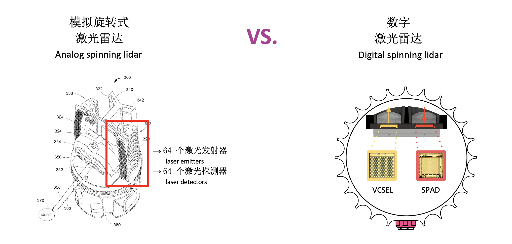
>
> 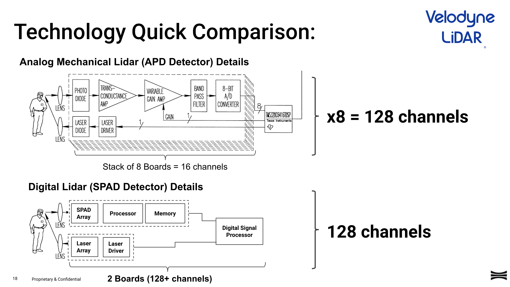
>
> 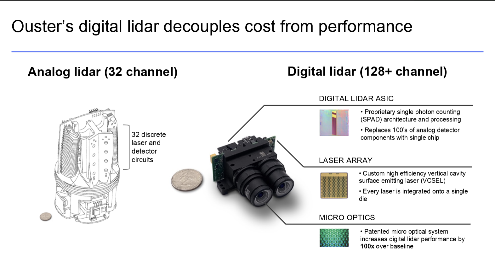

1. 什么是数字激光雷达，MBF与传统方案的区别是？

   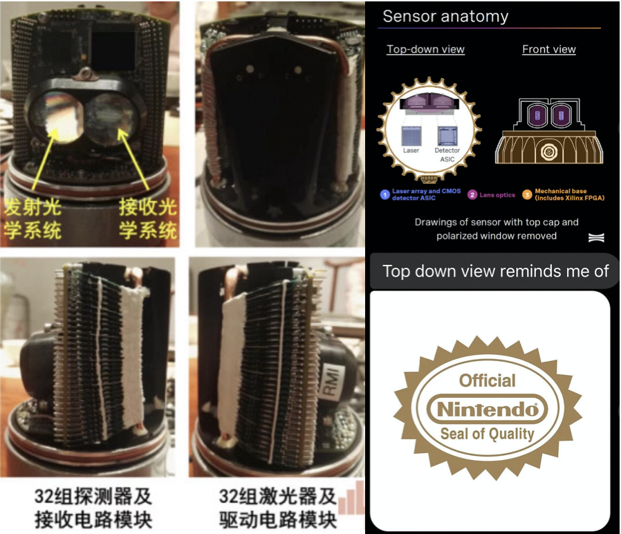

   传统方案，每个发射端包括对应线数的多颗EELD，每个LD后面带有PCB处理光源的驱动与调制；每个接收端包括对应线数的多颗APD，每个APD后面带有自己的PCBA处理强度采集、AD转换、阈值比较、信噪滤波与计算处理单元；N线机械式激光雷达需要N组IC芯片组：跨阻放大器（TIA）、低噪声放大器（LNA）、比较器（Comparator）、模数转换器（ADC）等。如果采用进口的激光器（典型的如Excelitas的LD）和探测器（典型的如滨松的PD），1K数量下每线激光雷达的成本大约200美元，国产如常用的长春光机所激光器价格能低一些。所以随着线数增加，成本、结构、体积与器件复杂度严重增加，可靠性性指数降低，且每一路信号都需要单独校准标定，批次间一致性差，批次内甚至每个雷达内的像素关系随着时间（温度、振动与结构公差等）都发生变化，比如平均上大多需要至多2000hr就要重新做一次标定。雷达发射只能基于定时发射而无法基于定角发射，VFOV方向是结构化但是轮询畸变数据，HFOV方向直接是非结构化数据。

   OS方案，MBF充分发挥了垂直腔面发射激光器（Vertical Cavity Surface Emitting Laser, VCSEL）和单光子雪崩二极管（Single Photon Avalanche Diode, SPAD）的优势，“闪光”指全像素并发发射与并发接收，“多光束”指用精确的光束而非大量泛光来照明整个场景。在可靠性、耐用性、低噪音、高温运行、电气效率、紧凑性、成本、与外围组件的直接集成、由消费电子产业推动的大规模外围研发，以及基本性能方面存在巨大改进空间。

   基于此，无论多少线，OS雷达内永远只有收发合计2枚芯片，发射端用VCSEL将多颗发射单元及后端处理线路放在一颗SOC上，接收端自研Spads ASIC将全部像素及后端处理电路全部聚集在一颗芯片上，随着线数增加，成本、结构、体积、器件复杂度、设备可靠性没有很大变化，一路标定全部标定，一次标定终生标定；相对友商40-100hrs/unit的生产效能，OS每小时就可以完成1部雷达从生产组装到调试标定的全程；像素元芯片内固化锁定，既可定时又可定角发射，VFOV方向是结构化并发无畸变数据，HFOV方向仍然是结构化数据，代表着更高的集成度、可靠性与数据前融合质量。

   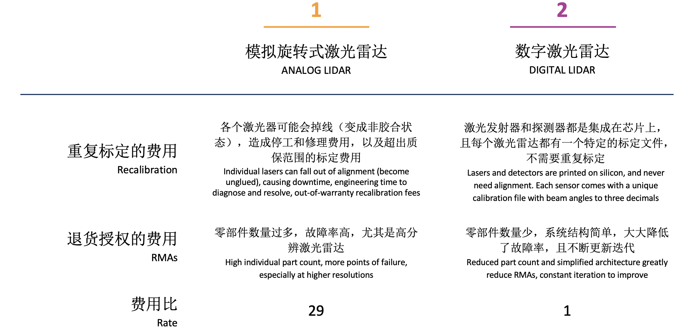

   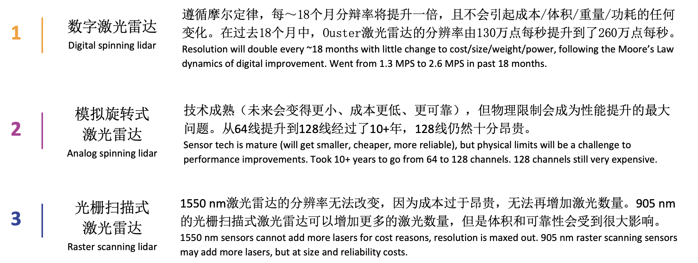

2. VSCEL 有什么优势，OS为何选用VSCEL？

   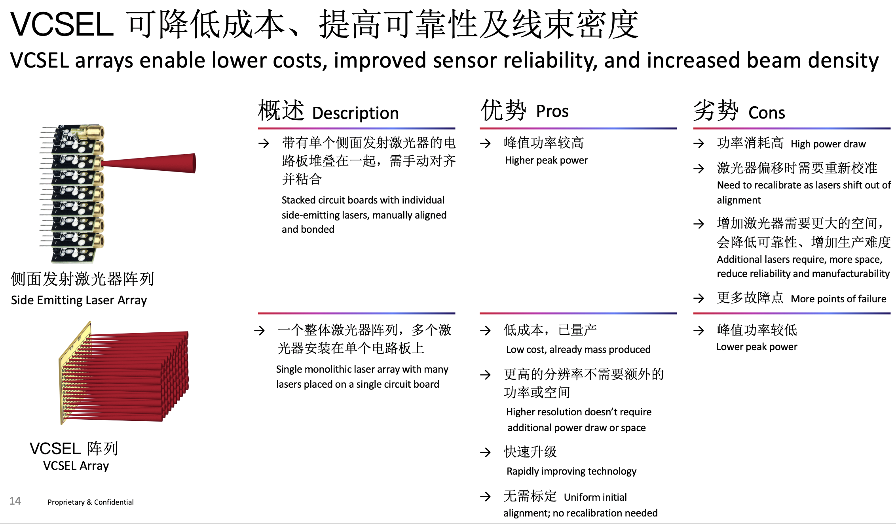

   Ouster采用VCSEL，因为它们比其它激光器技术更小、更轻、更耐用、更快、更易于制造，并且功率效率更高。目前激光雷达系统中使用的某些类型的脉冲激光器（例如，1550 nm光纤激光器），可能需要花费数千美元并且功耗达到数十或数百瓦，而Ouster的VCSEL成本要低几个数量级，功耗仅为数瓦，且尺寸更小巧。此外，随着全球上千亿颗VCSEL出货，Ouster还在性能、批量和成本方面遵循摩尔定律改进曲线。

   同时，Ouster的VCSEL与光学鼠标或智能手机中使用的器件不同。Ouster开发了定制化的VCSEL模块，将所有激光器整合在一颗半导体芯片上。此外，Ouster在VCSEL设计的每个层面都取得了突破，将VCSEL有效亮度提高了几个数量级，同时还将光脉冲缩短至几个纳秒。

   Ouster的单芯片VCSEL具有大幅降低系统复杂性和成本的附加优势。其它激光雷达需要在电路板上精密排布数十甚至数百个昂贵的激光器芯片和激光驱动电路，Ouster的激光雷达仅需要使用单颗激光驱动器和激光器芯片。因此，OS-1-64在每个方向上实现140米的探测距离，仅需要一块不超过一粒米大小的玻璃片。

3. SPads有什么优势，OS为何选用spads？

   ](spads.png)

   

   SPAD检测到光子时会产生一个二进制脉冲，具有单光子灵敏度、低噪声和极佳的时间分辨率（典型的抖动在10 ps和100 ps之间），以直接集成在CMOS晶圆中，从而在探测器旁边的硅基芯片上整合大量的信号处理，使它们成为Ouster激光雷达探测和超短激光脉冲的理想选择。

   随着激光雷达分辨率和数据速率的不断提高，片上信号处理至关重要。目前的OS-1-64探测器能够每秒计数并存储超过一万亿个光子到片上存储器中。这是一个庞大的数据量，Ouster已经在超过1000万个晶体管中实现100 GMAC/s（1 GMAC = 10亿乘法累加运算）的信号处理逻辑，最终能够每秒产生数百万个3D点，其客户可用于自动驾驶、环境测绘以及识别障碍物。

   SPAD也沿着摩尔定律的性能曲线前进。虽然今天的SPAD可能仅有2-5%的效率，新的SPAD效率为20~30%（在850nm波长），随着技术的成熟，效率可提高至80%。SPAD探测器效率的提高，可以直接增加激光雷达的探测范围和分辨率，SPAD探测器10倍的效率提升，极有可能使OS-1实现640线的分辨率。与激光雷达中使用的传统探测器技术不同，Ouster的SPAD技术已经实现了市场领先的性能，但仍然具有一个数量级的改进空间。

4. OS雷达是固态雷达还是机械雷达，还是混合固态雷达？

   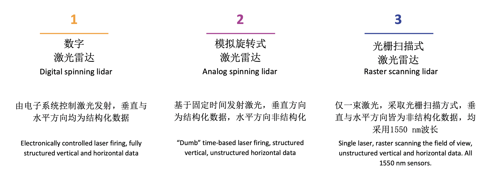

   机械雷达通常指全部旋转与飞镜摆镜旋转，纯固态雷达一般指OPA光相控阵电磁扫描，或者泛光flash非扫描；混合固态看如何定义，通常是指的MEMS微振镜路线，宏观上没有旋转元器件，微观上通过压电/热电/磁致伸缩材料做微振镜进行惯性扫描，优点是比目前所有固态雷达产业链成熟（一维与二维振镜，相对于OPA光相控阵没见过活的）及量程中等偏上（相对于传统泛光flash能效低一般30m以内），缺点是，视场角小，抗振差，惯性扫描有加减速平台，光圈小，无法做成环视等。

   OS的架构特点：所有的收发，无论多少线，统一放在1颗ASIC里，发射端VSCEL（把EELD及光源驱动PCB外设都固态化了），接收端SPADS阵列（把APD及外置放大比较数模转化强度采集信噪处理计算给固态化了），后者相当于传统的泛光flash的接收端，但是为了在保留泛光flash的高可靠性的同时避免后者的能效不高的不足，我们将泛光照明改为多光束同轴旋转扫描。

   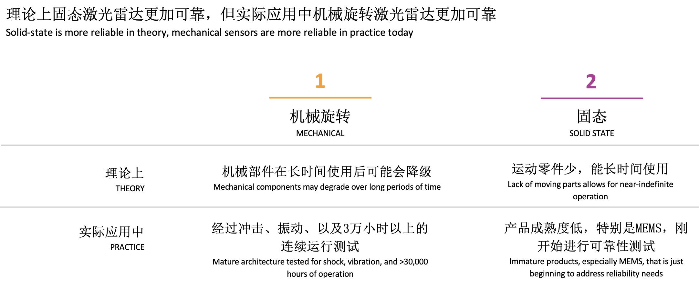

5. Livox 是固态或混合固态雷达么？

   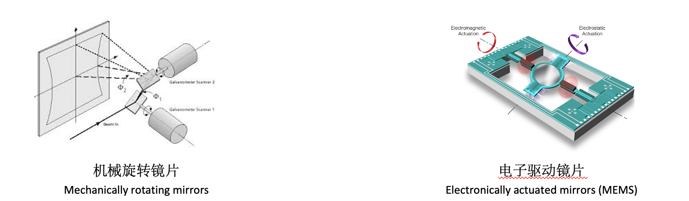

   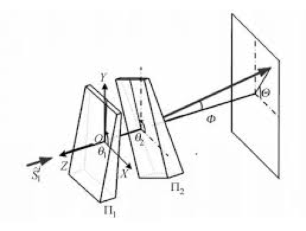

   - 不是，是宏观机械扫描当中的双飞镜惯性（宏观质量）扫描，而且是一种非均布的渐进收敛与多帧积分扫描，2枚机械飞镜具备2个正交扫描分量，而且还内置风扇。
   - 由于实际上其实属于单像素（或<=6通道, 4KHZ闪烁）时间轮询串发，本身等价帧率（约1-2hz）与点云时间密度(约10-24万点每秒单回波)相对偏低，无法适配动平台或高动态环境，或在动平台上仅作为避障传感器（无语义），无法用于定位导航建图。
   - 由于是机械双飞镜，又为了提帧而提速，所以其使用寿命受到影响；不像泛光flash不扫描，也不是MEMS微振镜微观质量扫描，也不是OPA非惯性电磁扫描，甚至不是机械圆周运动匀速，而是内置3枚电机，对振动环境下的可靠性与寿命影响尤大。
   - 即使是静平台与低动态场景，其在任何方位角上都是不同的时间戳，任意方位角上都是非结构化且时序轮询畸变数据（不同的测距原点），都需要做各速度分量的位移时间补偿；且测绘类应用与航向非正交部分是扫描分量无意义，进一步削弱等价帧率与有效点云密度；后续算法需要重建，无法复用VLP多年累积的长期训练数据，包括历史积累的数据集及训练模型，都无法平滑迁移。
   - 同时由于FOV偏小（比如tele15仅15°），需要多颗拼接（如24部，即使不overlap）才能形成完整视野，总重量（1.2kg*24=》20kg），总成本（9kx24=>220K）等，且多颗拼接要重新计入对应的结构标定与时间同步成本，及异构点云结构的拼接及后期维护成本。
   - 无法内置环境光相机，多数型号无内置IMU。
   - 但由于单位时间内工作像素少，所以class1等级下容许更高的发射功率，且瞬发fov极小，故而量程不错，是一款非常出色的高性价比双飞镜方案。

6. 业界同样或接近规格雷达多用903nm或905nm，甚至是1000nm以上波长，为何OS选择850nm或865nm？

   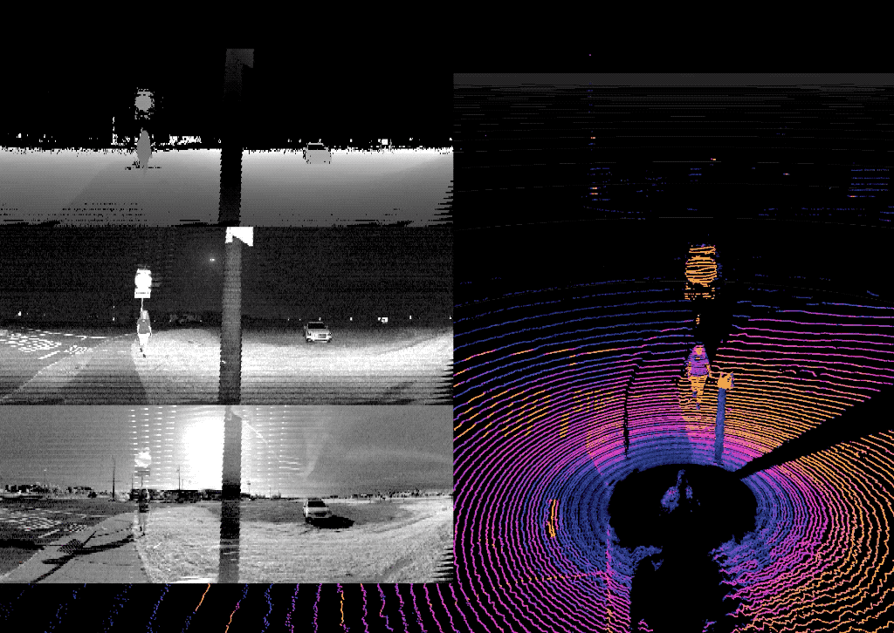

   1000nm以上波长多用光纤激光器，成本较高，体积较大，而且由于瑞利判据(Rayleigh Criterion)，波长越长其实极限分辨率越低，但因为单光子能量低，所以class1容许发射功率越高，进而测程较长；

   850/865/903/905nm都属于近红外波段，都可以使用成本较低的半导体激光器，选择903/905nm可以避开太阳光当中较强的近红外波段，在对应滤波片的配合下可以实现同等情况下较高的信噪比，这是为何多数选择该波段；

   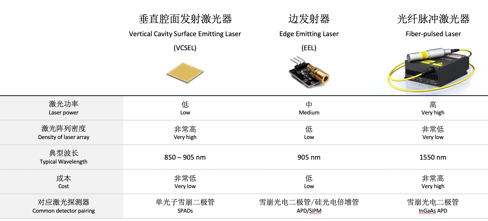

   OS雷达选择850/865nm作为工作波段，原因大致有4：

   - 更低的水汽吸收性：高层大气中的水蒸气吸收导致太阳光谱在905 nm、940 nm和1550 nm处有显著下降，但是激光脉冲在地表传输时，地面的雾等湿度条件也会产生同样的效应，吸收宝贵的激光能量，导致激光雷达接收器捕获的激光减少。相比之下，850 nm光谱在所有条件下都具有更低的大气水汽吸收，比其它流行的激光雷达工作波长（如1550 nm）要低几个数量级。这意味着Ouster激光不会在潮湿环境中被吸收，可以实现一致性更高的运行。当然，光谱的水蒸汽吸收问题不应与大气中的液态水（如雨水或浓雾）相混淆，这对所有激光雷达传感器来说都是挑战。
     - 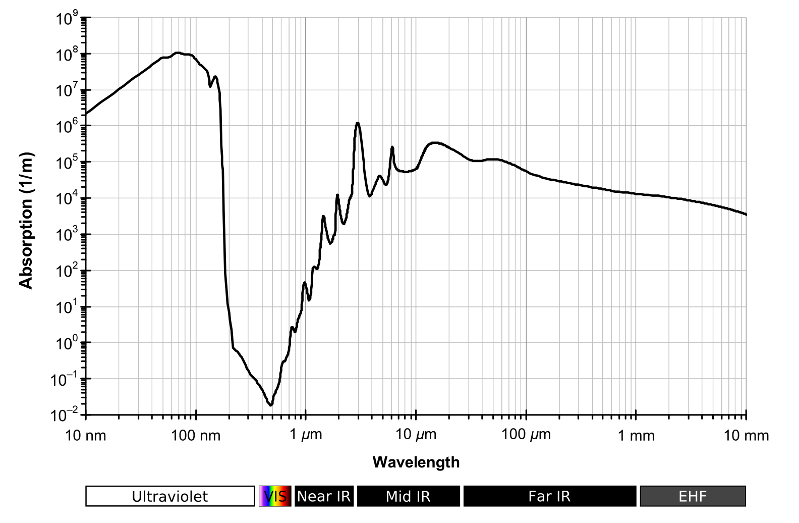
   - 更高的CMOS探测器灵敏度：硅基CMOS探测器在850 nm处比在较长波长处灵敏度高得多，例如，从850nm波长到905 nm波长灵敏度大约降低了2倍。在850 nm处设计Ouster激光雷达系统使其能够检测到更多反射回传感器的激光，这相当于获得了更长的探测距离和更高的分辨率。
   - 更高的环境图像质量：Ouster最近发布的固件使OS-1能够收集激光雷达成像以外的环境图像，850 nm工作波长便与此有很大关系。利用更多来自太阳的850 nm光子，环境图像具有更高的信噪比，这在黎明、黄昏或阴天时更加有用。
   - 采用更低功耗、更高效率的技术：Ouster专利技术使其能够相比竞争对手，将任何工作波长下的环境“本底噪声”降低一个数量级以上。这使Ouster激光器和接收器能够使用各种低功耗、高效率的技术，而这些技术通常被认为不可能在传统高性能激光雷达中应用。Ouster的技术专注于以更低的成本、更低的功耗、更小的尺寸和更少的组件来实现更好的性能。

7. 脉冲dtof，脉冲itof的区别是什么？

   - itof本质上是测相移：

   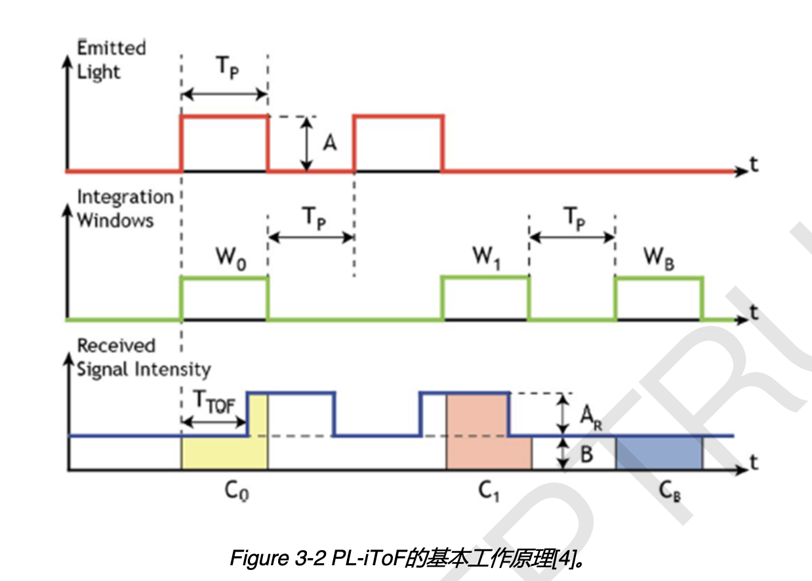
       
      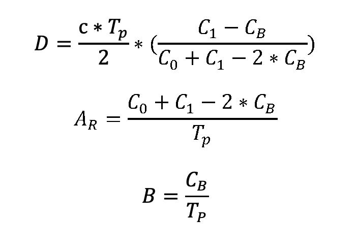
      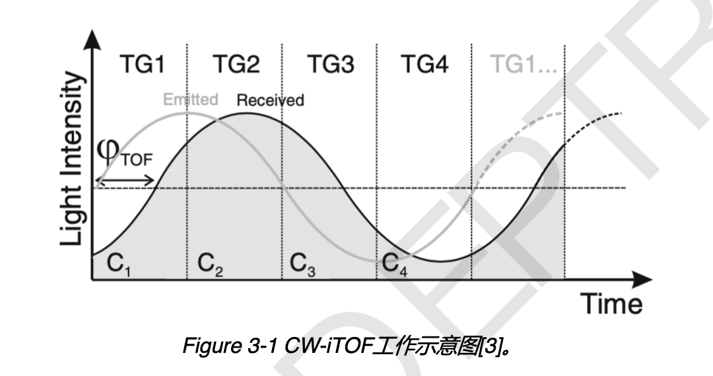
       
      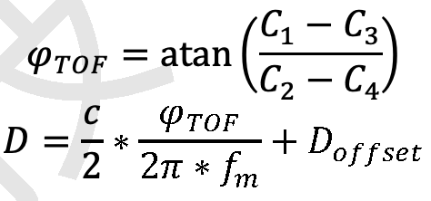

   - dtof 本质是直接TDC计算时间

8. 什么是并联冗余接收，有什么价值？

   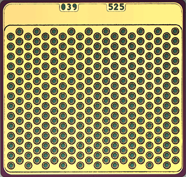

   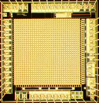

   我们每个像素下面其实并联了好多个亚像素，所以即使恶劣环境下，由于种种不可抗力部分或n-1像素瞎了，仍然维持工作，不像其他方案瞎了就是瞎了；这个还可以用于一些更复杂的比如后期pixel-specific filter-powered RGB-ID等场景，同时在不影响信噪比的情况下避免过曝风险。

9. 什么叫crosstalk或blooming？OS面阵如何解决串扰？

   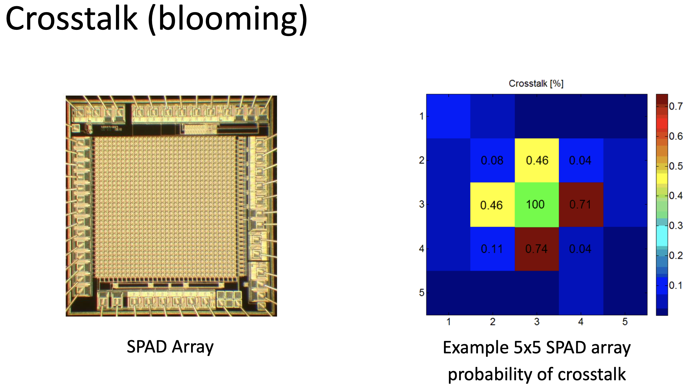

   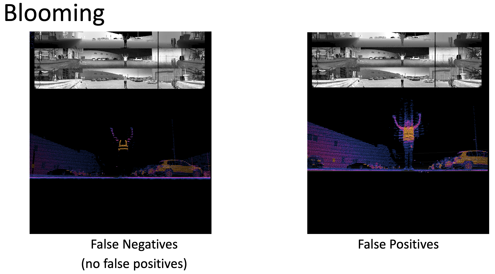

   - 芯片内阻隔层

   - 像素间亚像素intrinsic offset

   - 多层优化（光圈与镜头）的高准直专利光路

   - Time correlated single photon counting (TCSPC) 时间相关单光子计数及环境阈值比较器

   - 固件算法层面处理

   - 多次回波设计，如false positive 后面有回波，只接受后面回波，丢弃前置

   - 最新固件已允许客户自行确定滤除blooming力度，以便适应不同场景下需求（fw2.0）

     - ```sh
       set_config_param beta.bloom_reduction_enable true|false    #bit 28 flag in the range word, if 1, potential suspected blooming data
       ```

10. PD, APD与SiPM及spads的工作模式有什么不同？

    - PD – Photodiode, 1光子生1电子对
    - APD – Avalanche photodiode，一般是1光子生百电子
    - SPAD – Single-photon avalanche photodiode == SPPC – Single-pixel photon counter; another name for SPAD，无淬灭电路1光子生无穷，一旦激发就不再对后续光子敏感，仅作开关用
    - SiPM – Silicon photomultiplier == MPPC – Multi-pixel photon counter; another name for SiPM
    - PMT – Photomultiplier tube

    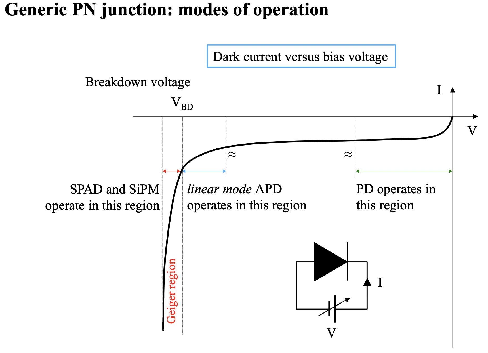

    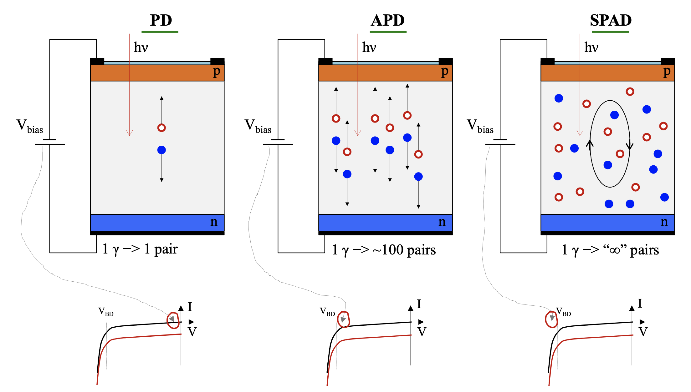

    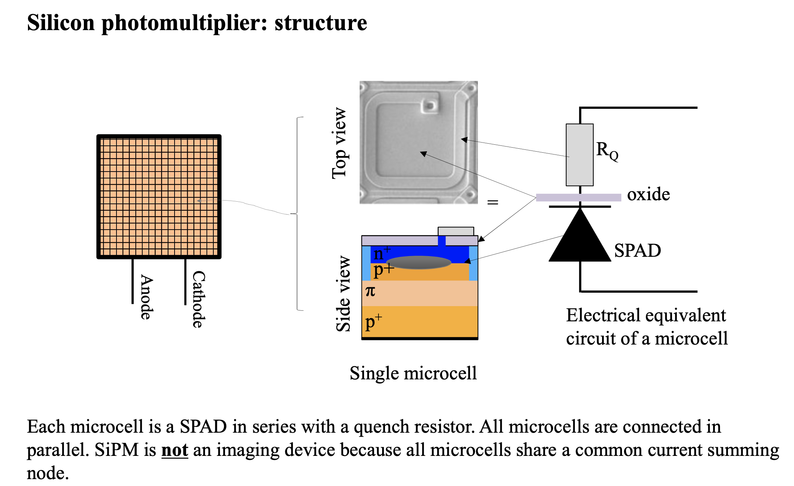

    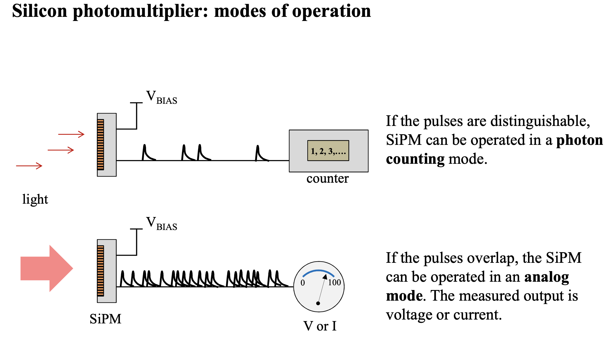

11. SIPM/APD 与 Spads 在测距感知上有什么区别？

    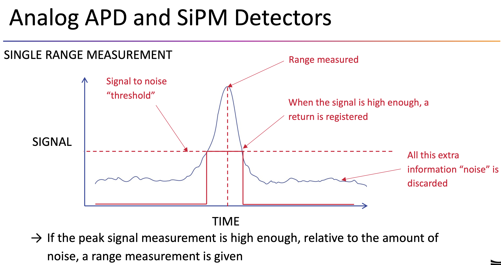

    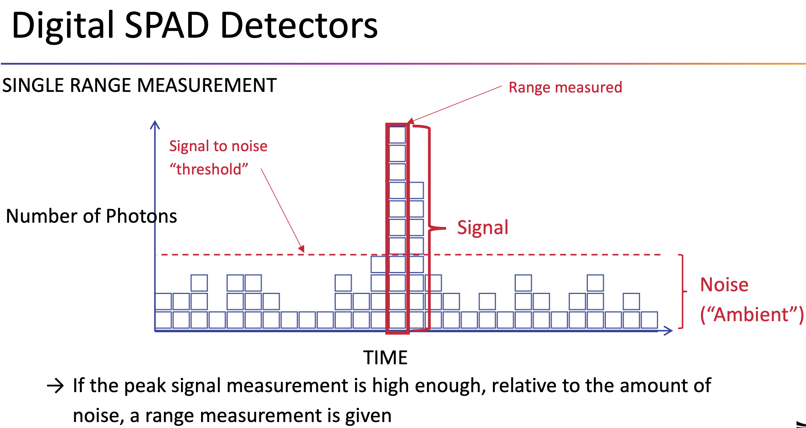

12. lidar 应用于感知有什么优点？

    极低的误报率（无中生有与有中测无），除了**crosstalk (“blooming”)** 时候。

13. 为什么产品手册标记了IP68与IP69K 2个指标？IP68不是已经最高的了么？或者IP69K不是已经覆盖了IP68了么？ 是指的有2种产品规格么？

    ```pascal
    意味着上述2个防护测试都完全通过：
    IP67：在15厘米到1米深的水中浸泡30分钟，能够防止水的进入。 
    IP68：在供应商规定的条件下，持续浸没在水中，能够防止水的进入。 
    IP69K：能够承受EN 60529和DIN 40050-9中定义的热蒸气冲刷测试。这能够提供水压在100 bar(1450 psi)，温度80ºC的防护。压力直接应用在感测器上，以30度的角度递进（0，30，60和90度），在每个角度持续30秒，共120秒（2分钟），能够防止水的进入。 
    
    这些IP防护等级往往没有被正确的理解，或者被错误的进行了应用。例如，许多用户认为IP67或者IP68防护等级允许将设备至于水中在规定时间之内的同时，能够正常的工作。事实并非如此，这些防护等级只能保证当设备从水中取出之后，仍然能够正常的运行。 
    另外一个可能的误解是，满足IP69K意味着自动满足IP67和IP68。其实，IP69K只能够防护冲刷压力，并不适用于浸没在水中的应用。因此，IP69K防护等级往往被用于经常清洗冲刷的应用中，例如酿酒厂，洗车厂和食品饮料厂中，但是并不适合被用于设备完全浸没在水中的场合。
    ```

14. MEMS 微振镜激光雷达有什么缺点？

    首先，MEMS微振镜不是没有机械部件，只是宏观不可见，而采用压电/热电/磁致伸缩材料来实现微观上的振动，而且由于其需要经过一个加减速与平台阶段，其单一振镜的有效角度极小（仅平台部分），而且其抗振/抗震等长期可靠性指标一直备受质疑。

    其次，信噪比和有效距离及FOV太窄。因为MEMS只用一组发射激光和接收装置，那么信号光功率与点云密度必定远低于机械激光雷达。同时 MEMS激光雷达接收端的收光孔径非常小，远低于机械激光雷达，而光接收峰值功率与接收器孔径面积成正比。导致功率进一步下降。这就意味着信噪比的降低，同时也意味着有效距离的缩短。扫描系统分辨率由镜面尺寸与最大偏转角度的乘积共同决定，镜面尺寸与偏转角度是矛盾的，镜面尺寸越大，偏转角度就越小。而镜面尺寸越大，分辨率就越高。最后MEMS振镜的成本和尺寸也是正比，目前MEMS振镜最大尺寸是Mirrorcle，可达7.5毫米，售价高达1199美元。速腾投资的希景科技开发的MEMS微振镜镜面直径为5mm，已经进入量产阶段；禾赛科技的PandarGT 3.0中用到的MEMS微振镜则是由自研团队提供。

    最后，由微振镜扫描而产生的点云仍然为非机构化数据，无法如图OS技术路线一样GID物理级前渲染，雷视一体高度结构化。

15. 什么叫时空锁定机制，有什么价值？

    空间锁定：所有像素关系终生固化为芯片内部，不像其他方案：手动挨个装一堆，然后同一部设备不超过2000hr就需要重新标定一次，如果环境恶劣可能是几百小时就得重新标定，更不提批次间不一致; 

    时间锁定：并发，而非串发，所以所有线数收发共享时域。 假设128线，有128ms 发射时间，意味着每条线都有128ms，而不是串发128/128=1ms，所有可以对单一方向进行更多次测量滤波优化。

    并发示意图：.gif)

    串发示意图：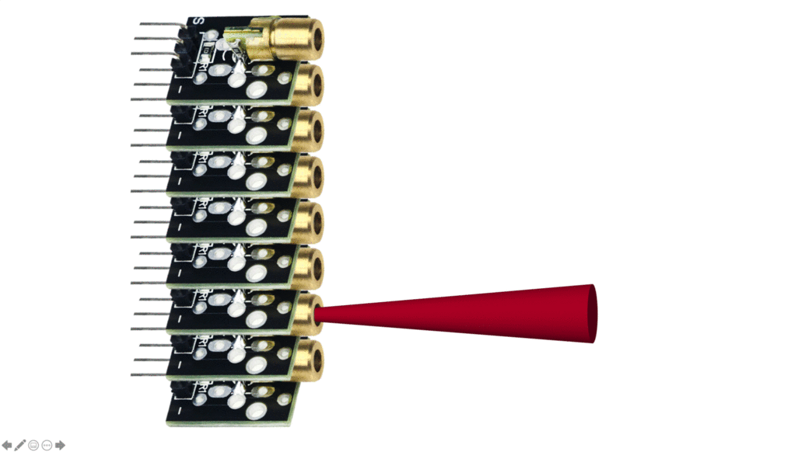

    

    

    

    

    

    

    