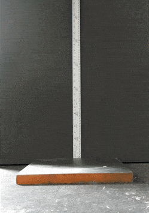
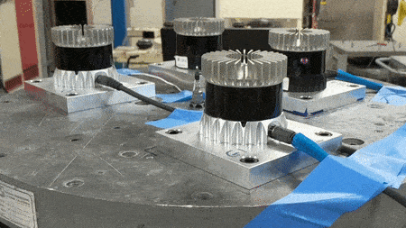
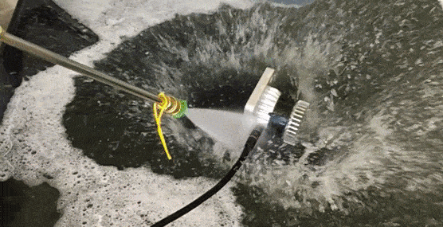
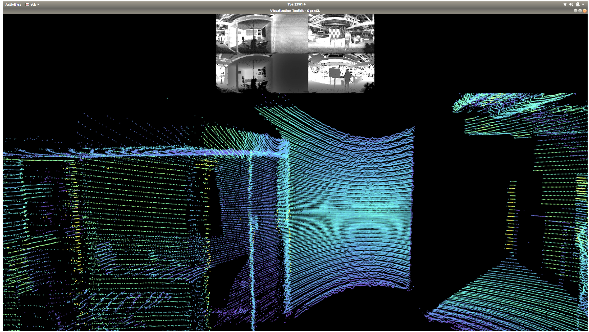
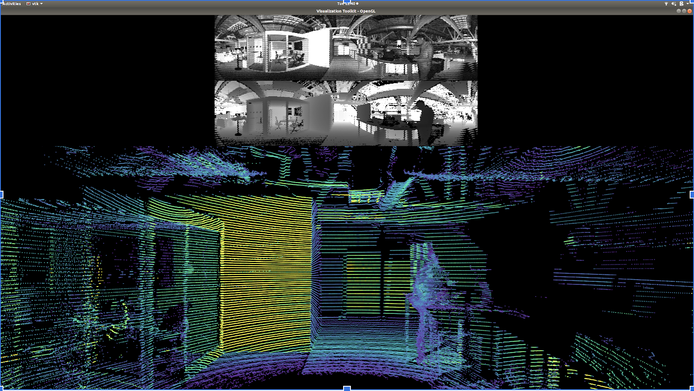
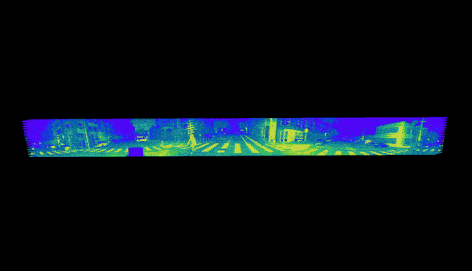
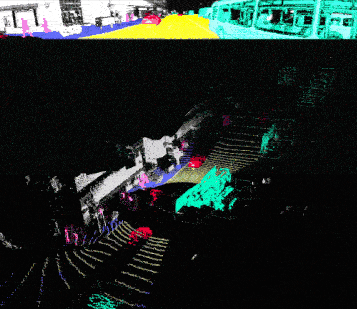

# 常见问题

> 此处整理问题，汇总更新，如有问题，请加微信：Kungfuas

1. 是否支持POE+?

   是的，但目前并未量产该ibox

2. 是否支持clamshell？

   是的，但目前并未量产该mounting

3. 标准交期是多久？

   ASIC2019在封城疫情期间仍然维持2周，ASIC2020 封城一清期间暂定6-8周。

4. 屏幕点云闪烁是什么原因？

   <video src="videos/1589272302572522.mp4"></video>

   这是典型的udp package loss 丢包，请检查 Cable/Hub以及网卡是否是 **真千兆** ，一般更换之后就会消除

5. windows下默认被识别为IPV6如何操作？

   参考：[OusterStudio @windows](/OusterStudio)

6. 断网关防火墙之后，仍然无效是因为如何？

   重启一下，有部分windows重启后防火墙才真正设置生效

7. 在XXm处多大物体切割多少个点正常么？

   这是一个基于安装位置，安装角度，距离，待测物体的投影面积（高度决定线数，宽度决定点数），发射模式与帧率共同决定的，是一个三角函数问题（看下多少提前上天锄地），以及记得看下默认发射方式是1024x10，而不是2048x10，如果你用的默认发射方式的话。

8. OS的雷达，pixel distance也会随着时间或振动发生变动么，也需要不超过2000hr必须重新校准么？

   不需要，像素元芯片内空间锁定固化，设计寿命内不发生变动

9. 对于尘霾矿场的情况呢？

   灰尘其实一种是在空中潜伏的，一种是落在雷达表面的，所以对灰尘的处理上，首先是不能让灰尘进入雷达造成设备损坏，我们这点上是ip69k。其次，是落在镜头处的灰尘不能影响感知，我们的解决方案是超大光圈，大概是别人的5-10倍。最后是高速漂浮的灰尘不要形成鬼点或者拖曳痕，我们的解决方案是采用了百万分之一秒的超高速快门解决动态糊化，然后采用了最强回波把来自灰尘的弱遮挡信息滤除，只认可灰尘后更强实体的回波。

10. Ubuntu下寻找全部雷达IP的命令是？

    avahi-browse -lr _roger._tcp

11. 客户可以自行及动态更改VFOV么？

    目前并未下发授权Key

12. IMU是硬连接还是软连接，输出原始观测量还是解算值，fps是否可调？

    硬连接，原始观测量，fps固定

13. OS雷达的可靠性如何？

    

    

14. 三帧相机的效果是？

    

    

    

    

    

    15. 标准线缆多长？最长可多长？

        5m，目前直到10m有库存，更长可达100m，但需要定制

    16. 

