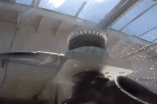

# 常见问题

> 此处整理问题，汇总更新，如有问题，请加微信：Kungfuas

1. 是否支持POE+?

   是的，但目前并未量产该ibox

2. 是否支持clamshell？

   是的，但目前并未量产该mounting

3. 标准交期是多久？

   ASIC2019在封城疫情期间仍然维持2周，ASIC2020 封城一清期间暂定6-8周。

4. 屏幕点云闪烁是什么原因？

   <video src="videos/1589272302572522.mp4"></video>

   这是典型的udp package loss 丢包，请检查 Cable/Hub以及网卡是否是 **真千兆** ，一般更换之后就会消除

5. windows下默认被识别为IPV6如何操作？

   参考：[OusterStudio @windows](/OusterStudio)

6. 断网关防火墙之后，仍然无效是因为如何？

   重启一下，有部分windows重启后防火墙才真正设置生效

7. 在XXm处多大物体切割多少个点正常么？

   这是一个基于安装位置，安装角度，距离，待测物体的投影面积（高度决定线数，宽度决定点数），发射模式与帧率共同决定的，是一个三角函数问题（看下多少提前上天锄地），以及记得看下默认发射方式是1024x10，而不是2048x10，如果你用的默认发射方式的话。

8. OS的雷达，pixel distance也会随着时间或振动发生变动么，也需要不超过2000hr必须重新校准么？

   不需要，像素元芯片内空间锁定固化，设计寿命内不发生变动

9. 对于尘霾矿场的情况呢？

   灰尘其实一种是在空中潜伏的，一种是落在雷达表面的，所以对灰尘的处理上，首先是不能让灰尘进入雷达造成设备损坏，我们这点上是ip69k。其次，是落在镜头处的灰尘不能影响感知，我们的解决方案是超大光圈，大概是别人的5-10倍。最后是高速漂浮的灰尘不要形成鬼点或者拖曳痕，我们的解决方案是采用了百万分之一秒的超高速快门解决动态糊化，然后采用了最强回波把来自灰尘的弱遮挡信息滤除，只认可灰尘后更强实体的回波。

10. Ubuntu下寻找全部雷达IP的命令是？

    avahi-browse -lr _roger._tcp

11. 客户可以自行及动态更改VFOV么？

    目前并未下发授权Key

12. IMU是硬连接还是软连接，输出原始观测量还是解算值，fps是否可调？

    硬连接，原始观测量，fps固定

13. OS雷达的可靠性如何？

    

    

14. 三帧相机的效果是？

    

    

    

    

    

    15. 标准线缆多长？最长可多长？

        5m，目前直到10m有库存，更长可达100m，但需要定制

    16. 工作温度指的是环境温度，还是雷达自身温度？有无进一步拓宽温度区间的计划？

        指的是环境温度，特别是相对靠近雷达工作空间的环境温度；我们在Q2可以实现-45℃到70℃，在O4会实现-45℃到80℃

    17. 如果移除底板与顶部散热片，在密闭室内过热，会导致雷达烧坏么？

        通常不会，我们雷达具备自保护机制，一旦过热会尝试降低发射率与帧率，如果严重过热，会断电自保护。

    18. 什么叫时空锁定机制，有什么价值？

        空间锁定：所有像素关系终生固化为芯片内部，不像其他方案：手动挨个装一堆，然后同一部设备不超过2000hr就需要重新标定一次，如果环境恶劣可能是几百小时就得重新标定，更不提批次间不一致; 

        时间锁定：并发，而非串发，所以所有线数收发共享时域。 假设128线，有128ms 发射时间，意味着每条线都有128ms，而不是串发128/128=1ms，所有可以对单一方向进行更多次测量滤波优化。

    19. 什么是并联冗余接收，有什么价值？

        我们每个像素下面其实并联了好多个亚像素，所以即使恶劣环境下，由于种种不可抗力部分或n-1像素瞎了，仍然维持工作，不像其他方案瞎了就是瞎了；这个还可以用于一些更复杂的比如后期pixel-specific filter-powered RGB-ID等场景，同时在不影响信噪比的情况下避免过曝风险

    20. 什么是子光束指向及密度分布，有什么价值？

        纵向FOV 可以变化，可以比如降低到50% 而维持线数不变，可以中间密两边疏，可以只水平向下，如果特别大的用户，我们还可以给他定制，参照此处：https://drive.weixin.qq.com/s?k=AEYARQeBAAYoGIegvHAE4AvQanABU

    21. 什么是无线供电与POE+供电？

        无线供电指的是相对于某些友商采用的滑环接触供电的使用寿命而言，我们是无接触供电，POE+指的是我们与google共享的一个专利设计ibox，可以直接网线同时作为数据传输与供电。

    22. 黑匣子有什么用？

        记录从出厂以来的全部操作，用于：

        - 保修期追溯
        - 最近一次的信息采用json明文记录，历史信息bin文件加密，如果遇到问题可以第一时间回传，远程实时判定问题并提供意见
        - 如果确认责任归属于OS，则OS可以提前安排返修或退换，无需等待太长周期

    23. 目前相机是额外一套cmos相机么，最高像素是多少，是彩色相机么？

        并非额外外设，是spads复用，自身不发射，全部来自环境光的灰度信息，最高像素2048*N，N为线数，是灰度相机，但是3帧相机数据是原生时空对齐的。

    24. 目前是多次回波方案么？

        目前选择的是最强回波方案，我们计划在Q4加入多次回波

    25. 什么是数字激光雷达，MBF与传统方案的区别是？

        传统方案，每个发射端包括对应线数的多颗EELD，每个LD后面带有PCB处理光源的驱动与调制；每个接收端包括对应线数的多颗APD，每个APD后面带有自己的PCBA处理强度采集、AD转换、阈值比较、信噪滤波与计算处理单元，所以随着线数增加，成本、结构、体积与器件复杂度严重增加，可靠性性指数降低，且每一路信号都需要单独校准标定，批次间一致性差，批次内甚至每个雷达内的像素关系随着时间都发生变化，比如平均上大多需要至多2000hr就要重新做一次标定。

        OS方案，无论多少线，里面永远只有收发2枚芯片，发射端用VCSEL将多颗发射单元及后端处理线路放在一颗SOC上，接收端自研Spads ASIC将全部像素及后端处理电路全部聚集在一颗芯片上，随着线数增加，成本、结构、体积、器件复杂度、设备可靠性没有很大变化，一路标定全部标定，一次标定终生标定，像素元芯片内固化锁定，代表着更高的集成度与可靠性。

    26. 

