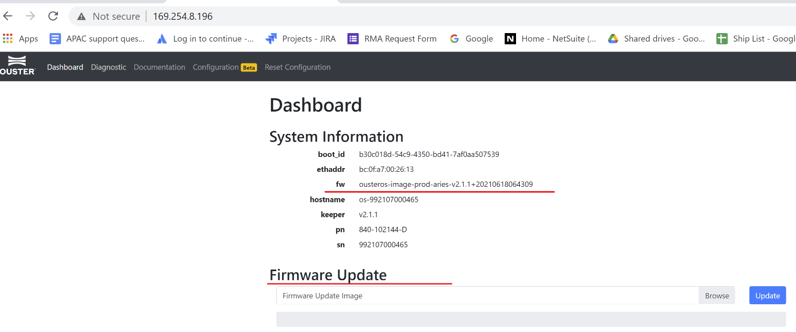

# 固件升级指引

> PDF手册：https://drive.weixin.qq.com/s?k=AEYARQeBAAY9mZ599R
>
> 有问题请加微信：Kungfuas

## 1. 确保电脑与雷达连通

具体方法请参看[《如何查询雷达IP并连接》](NetworkIP)。

## 2. 通过网页登录雷达

直接在浏览器中输入雷达IP并回车，就可以登录上雷达。默认显示的是Dashboard页面。

## 3. 确认雷达固件版本号并升级固件

上面的截图中，“fw”所对应的信息就是雷达当前固件的版本，图中的版本号是v2.1.1. 确认该处显示的版本号是否为最新版。如果不是最新版，则可以到我司官方下载网页上下载最新的固件，然后点击上图所示雷达主页上的“Browse”选择固件的镜像文件，最后点击“Update”按钮安装。耐心等待3分钟左右，确保升级固件的进度条满格，此时雷达会自动重启一次。刷新网页直到网页重新加载雷达信息（当雷达IP为动态分配所得，则有可能雷达固件升级后其IP也会变化，因此不管怎么刷新页面都无法内容的再次加载，此时需要重新查询雷达IP并连接）。

 

 

