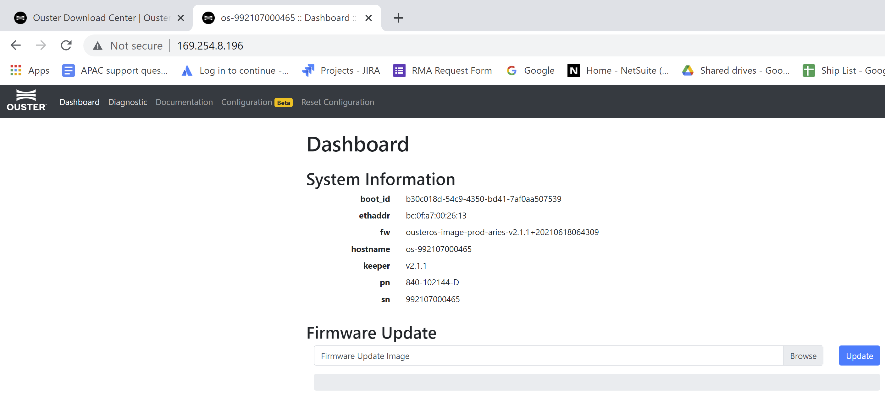
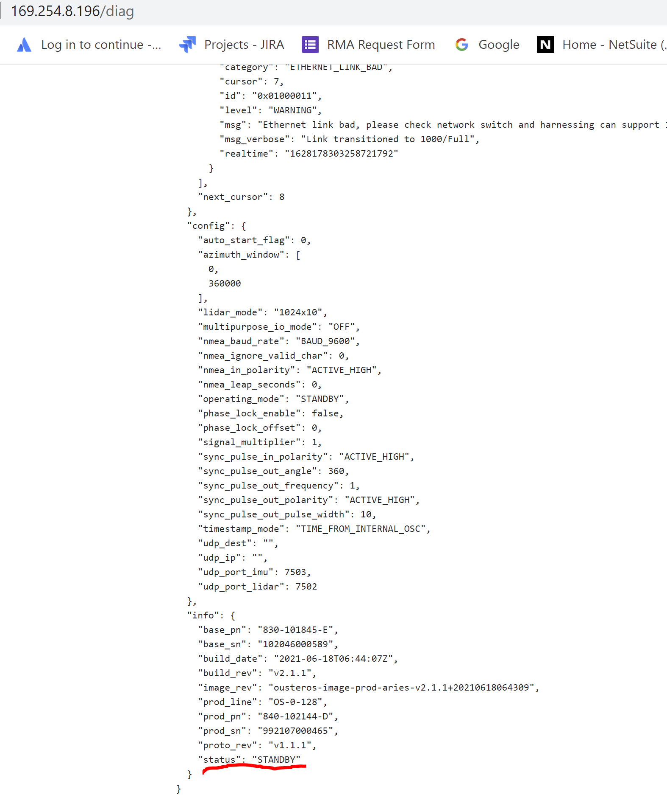
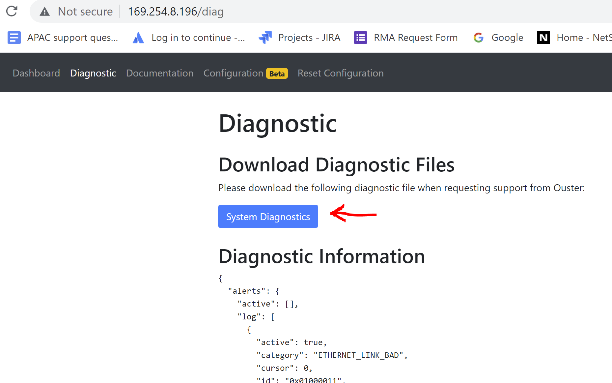

# 系统黑匣子日志log

> 黑匣子日志记录出厂以来的全部操作与雷达状态，包括但不限于上电时间时长，配置情况，环境温度振动情况等，用于：
>
> - 保修期追溯
> - 最近一次的信息采用json明文记录，历史信息bin文件加密，如果遇到问题可以第一时间回传，远程实时判定问题并提供意见
> - 如果确认责任归属于OS，则OS可以提前安排返修或退换，无需等待太长周期
> - 当雷达出现异常时，往往需要从雷达内部下载log来进行分析。下载log可以直接在网页端实现，也可以命令行获取。

## 1. 确保电脑与雷达连通

具体方法请参看《如何查询雷达IP并连接_HowToQueryLidarIPv4Address&Connect》。

## 2. 通过网页登录雷达

> 浏览器访问http://OS(1)-SN.local或IP并回车，就可以登录上雷达。默认显示的是Dashboard页面。

                               

## 3.  查看雷达运行状态

> 点击网页上方的Diagnostic选项，进入Diagnostic页面。然后下拉到底部，可以看到Status状态信息。如果该Status显示为Error，或者一直处于Initializing状态而无法退出，则表明雷达确实存在状态异常。此时可以粗略看一下页面上方的alerts信息（都是当前开机后所记录的雷达异常信息），看看存在哪些具体的状态异常。

 

## 4. 下载雷达log

> 点击Diagnostic网页上方的System Diagnostics蓝色按钮，雷达的log（.bin文件）会自动下载到系统的Download文件夹。请将其发给Ouster进行故障诊断分析。

 

## 5. 命令行下载日志

```sh
#Curl command for MetricsDb: 
curl <sensor_ip>/api/v1/system/metricsdb/dump > dump

#Curl command for Journal: 
curl <sensor_ip>/api/v1/system/journal/dump > journal.bin
```

