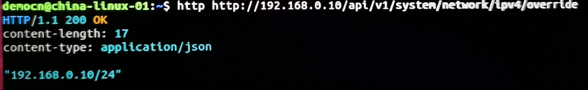
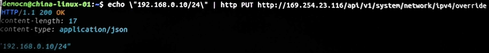
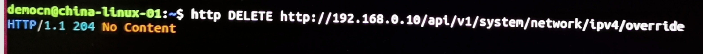

# Ouster LiDAR 静态IP设置


> 配置雷达静态IP目前还需要在Linux或者MacOS中通过命令的方式实现。我们计划在下一版固件推出后允许客户直接在网页上修改雷达的IP。以下介绍还是基于Ubuntu系统来实现雷达IP配置的。

## 准备步骤

### 设置本地端口地址（可跳过）

- 打开网络设置，点击本地连接配置按钮


- 自定义本地端口IPv4地址


- 断开/重新连接本地连接


- 命令行中输入 `ip addr` 检查本地IP设置是否成功


### 查找雷达当前IP

 连接雷达, 命令行输入 `avahi-browse -lr _roger._tcp` 查找雷达当前地址（eg. 169.254.32.4）


## `httpie` 方法

> 新固件override后面不要放/

### 1.安装 httpie

- 打开命令行（快捷键`Ctl` + `Alt` + `T`)
- `sudo apt install -y httpie`

### 2.验证IP是否为静态IP，命令行输入

```sh
sudo apt install -y httpie

http http://[雷达当前IP地址]/api/v1/system/network/ipv4/override # 这路注意，新版本固件overriede后没有斜杠！！！！
# 以下截图为示例，其中“OK”字样表明该IP是静态IP。如果显示为“null”则表明不是静态IP。
```

- 旧版本固件：


- 新版本固件：

  

### 3.设置静态IP ：

> 雷达IP设置成功后**需要重启雷达**才能生效。
>
> 另外，如果<u>新的IP与老IP不在一个网段</u>内，电脑后续如果需要继续连接雷达，那还需要同样修改网卡的IP。

```bash
echo \"[你想设置的静态IP]/24\" | http PUT http://[雷达当前IP地址]/api/v1/system/network/ipv4/override   # 这路注意，新版本固件overriede后没有斜杠！！！！

#上图中命令执行后的结果中显示有 “OK”，表明设置成功了。

#上面命令中“24”是给雷达设置的子网掩码（subnet mask），在这里24=255.255.255.0. 这个子网掩码是最常使用的，当然某些特殊情况下子网掩码可能需要设置为255.255.0.0, 这时可以将24改成16即可。下面是执行的一个例子：
```
- 旧版本固件：

- 新版本固件：

  

### 4.取消静态IP

> **不需要重启即可生效。**

```bash
#可通过如下命令删除雷达静态IP，从而恢复动态IP分配模式：
http DELETE http://[静态IP]/api/v1/system/network/ipv4/override   # 这路注意，新版本固件overriede后没有斜杠！！！！
#执行命令后雷达会自动进行动态IP分配（DHCP模式），不需要重启即可生效。


# 另一个删除静态IP的方法是直接在GUI 网页上连接雷达，然后点击“Reset”菜单。
```

-  旧版固件：


- 新版固件：




 #### 常见问题

1. **args: List[Union[str, bytes]] = sys.argv**
    - 重装 httpie `sudo apt install httpie --reinstall`

> 详情参考《用户手册》 HTTP API 中 system/network

---
[回首页](README)